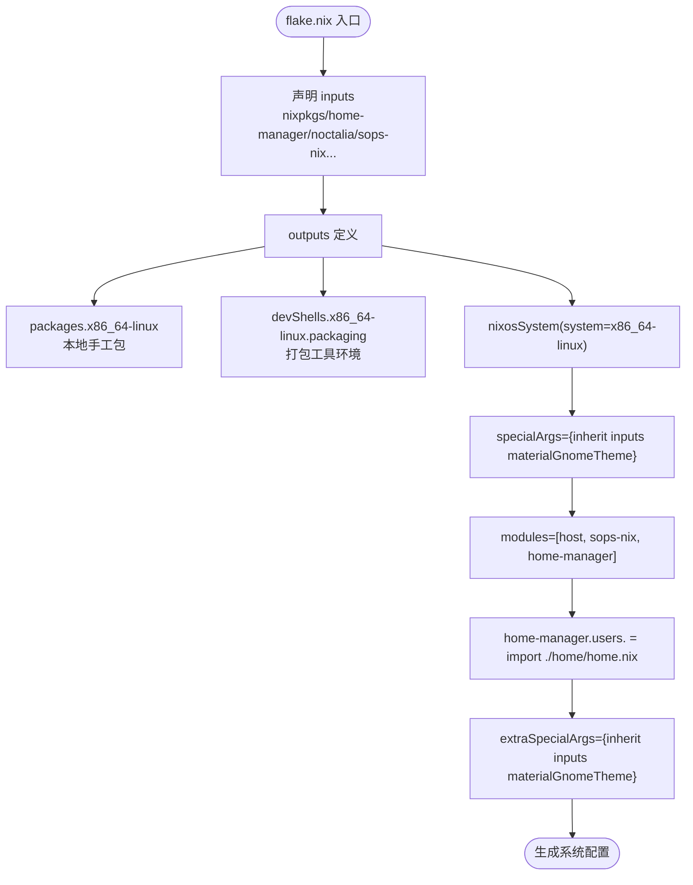
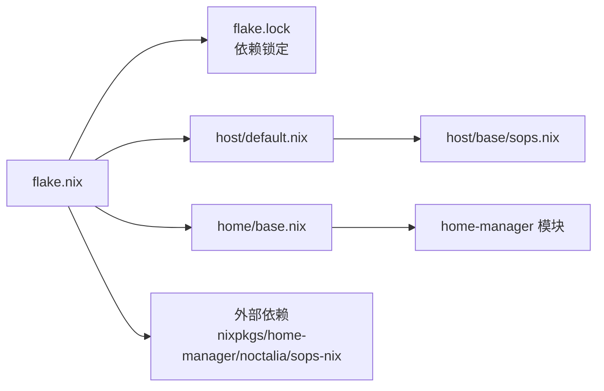
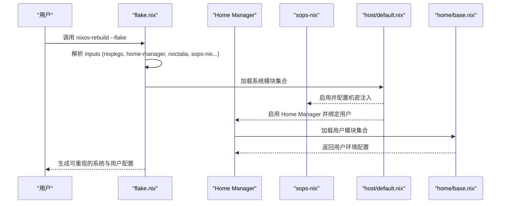

# Flake 配置管理

## 目录
1. [简介](#简介)
2. [inputs：外部依赖](#inputs外部依赖)
3. [outputs：系统装配](#outputs系统装配)
4. [依赖锁定与跟随](#依赖锁定与跟随)
5. [装配流程](#装配流程)
6. [最佳实践](#最佳实践)
7. [相关链接](#相关链接)

## 简介

`flake.nix` 是整个仓库的统一入口，采用「系统级配置（`host`）+ 用户级配置（`home`）」的分层组织方式。它集中声明外部依赖，并在 `outputs` 的 `nixosConfigurations` 中定义具体主机配置；`flake.lock` 锁定所有依赖版本，确保跨时间、跨机器的可重现构建。

## inputs：外部依赖

`flake.nix` 的 `inputs` 部分声明了系统所需的全部外部来源：

- `nixpkgs`：跟踪 `nixos-unstable` 频道，作为基础包集与 NixOS 模块来源。
- `home-manager`：用户环境管理框架。
- `noctalia` / `noctalia-greeter`：桌面壳与登录界面模块。
- `sops-nix`：机密管理与注入。
- `nix-flatpak`：Flatpak 集成。
- `llm-agents` / `codex-desktop-linux`：AI 与桌面工具扩展能力。

多数输入通过 `inputs.nixpkgs.follows = "nixpkgs"` 复用根 `nixpkgs`，避免多份版本碎片化。

## outputs：系统装配

`outputs` 同时提供本地包、打包开发环境和名为 `MechRevo-NixOS` 的系统配置：

- `packages.x86_64-linux` 暴露全部 `local-deriv/` 手工包，可用 `nix build path:.#<pname>` 独立构建。
- `devShells.x86_64-linux.packaging` 提供 `$nix-package` 流程使用的预取、更新、格式化和 ELF 诊断工具。
- `nixosConfigurations.MechRevo-NixOS` 使用 `nixpkgs.lib.nixosSystem` 装配系统。

- `system` 指定为 `x86_64-linux`。
- `specialArgs` 将 `inputs` 与共享的 `materialGnomeTheme` 传入系统模块。
- `modules` 列表组合：本地 `host/default.nix`、sops-nix 和 Home Manager 的 NixOS 模块。
- Home Manager 侧：`useGlobalPkgs`/`useUserPackages` 开启，`backupFileExtension = "hm-backup"`，主配置指向 `home/home.nix`，GNOME 变体指向 `home/gnome.nix`。

各子模块的组合方式：`host/default.nix` 导入共享的 `host/base/default.nix` 与主桌面的 session/greeter；`host/base/default.nix` 再集中导入 `boot`、`hardware`、`locale`、`nix`、`users`、`network`、`services`、`desktop`、`gaming`、`virtualization`、`containers`、`sops`。`home/base.nix` 导入两个变体共享的环境、开发、生产力和娱乐模块，并启用 nix-flatpak 用户模块；主题与桌面模块由各自 HM 入口组合。

## 依赖锁定与跟随

- **依赖锁定**：`flake.lock` 记录所有直接与间接依赖的版本、提交哈希与来源，确保构建可重现。
- **依赖跟随**：`home-manager`、`noctalia`、`sops-nix` 等通过 `follows` 复用根 `nixpkgs`，避免多份不同版本冲突。
- **升级路径**：`nix flake update` 更新锁文件，配合 rebuild 验证；失败可回退到上一代次。

## 装配流程

一次 `nixos-rebuild` 从 Flake 到用户环境的装配顺序：

## 最佳实践

- 始终提交 `flake.lock` 锁定依赖，避免版本漂移。
- 通过 `follows` 复用 `nixpkgs`，减少版本碎片化。
- 手工包通过 `$nix-package` 维护，并用 flake package output 独立构建后再进入系统 dry-build。
- 打包辅助工具从 `nix develop .#packaging` 获取，不常驻安装到用户环境。
- 系统级变更用 `sudo nixos-rebuild switch --flake .`；用户级变更由 rebuild 自动处理。
- 缓存加速：在 `host/base/nix.nix` 配置多个 substituters（官方 + 镜像源），并启用 `nix-command`、`flakes` 实验特性；`nh` 自动清理旧代际以维持磁盘空间。

## 相关链接

- [系统架构总览](index.md)
- [主机系统架构与启动流程](host.md)
- [项目概述](../overview.md)
- 为何锁定 unstable 频道：[../../memory/cards/flake-unstable-strategy.md](../../memory/cards/flake-unstable-strategy.md)
