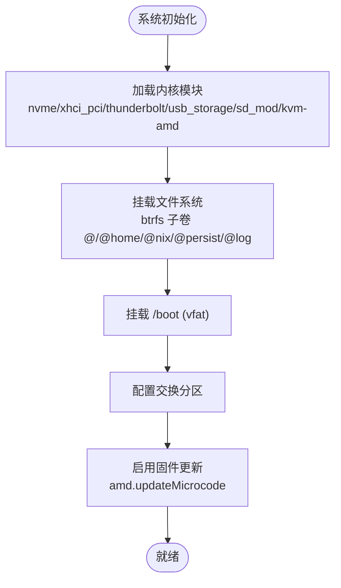
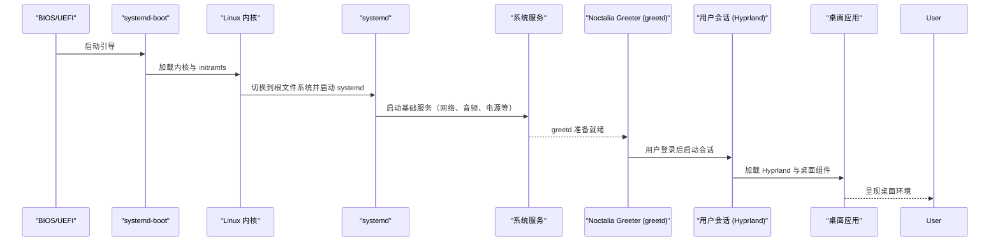
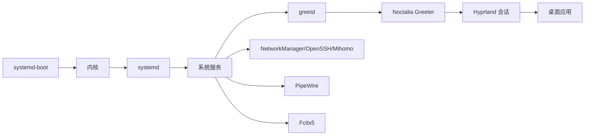

# 主机系统架构与启动流程

## 目录
1. [简介](#简介)
2. [硬件抽象层](#硬件抽象层)
3. [引导与内核](#引导与内核)
4. [启动流程：从固件到桌面](#启动流程从固件到桌面)
5. [服务与依赖](#服务与依赖)
6. [适配其他硬件平台](#适配其他硬件平台)
7. [故障排查](#故障排查)
8. [相关链接](#相关链接)

## 简介

主机层（`host/`）负责从 BIOS/UEFI 到桌面环境的完整系统构建，涵盖硬件抽象、引导加载器、内核参数、systemd 服务与登录会话初始化。硬件抽象被拆分为两部分：由 `nixos-generate-config` 自动生成的设备清单，以及在 `host/` 层手工维护的驱动与服务策略。这一「自动检测 + 手工增强」的设计，使不同机器可通过替换硬件清单并复用 `host/` 策略实现「一次编写，多机部署」。

## 硬件抽象层

`hardware-configuration.nix` 由 `nixos-generate-config` 扫描本机硬件生成，被 `host/default.nix` 导入作为硬件基线，包含：

- **initrd 可用模块**：`nvme`、`xhci_pci`、`thunderbolt`、`usb_storage`、`sd_mod`，保证早期能访问存储与 USB。
- **运行时模块**：`kvm-amd`（虚拟化）。
- **文件系统**：统一使用 UUID 绑定块设备，通过 btrfs 子卷组织 `/`、`/home`、`/nix`、`/persist`、`/var/log`；`/boot` 为 vfat 用于 EFI。
- **交换分区** 与 **CPU 平台/微码**：`nixpkgs.hostPlatform = x86_64-linux`，`hardware.cpu.amd.updateMicrocode` 跟随可再分发固件开关。

该文件顶部注释明确提示**不要手工修改**，变更应通过模块覆盖。`host/hardware.nix` 在其之上叠加 GPU 与外设策略：启用 `amdgpu` 驱动、声明 X server 视频驱动、通过 udev 规则设置串口设备（`dialout` 组）权限，并用 `nix-ld` 支持运行非 Nix 二进制。

## 引导与内核

`host/boot.nix` 负责引导与内核参数：

- 启用 `systemd-boot`（EFI），允许写入 EFI 变量便于管理引导项。
- `/boot` 使用 vfat 并**覆盖**自动生成值，将 `fmask`/`dmask` 收紧为 `0077`（更严格的 EFI 权限）；设备名仍从 `hardware-configuration.nix` 合并继承。
- 加载 `ntfs3` 模块以支持 NTFS。
- 内核参数 `amdgpu.dcdebugmask=0x40000` 禁用面板固件的非线性亮度曲线，规避本机 Radeon 780M 亮度溢出导致的全黑问题（详见 memory 卡片）。

## 启动流程：从固件到桌面

登录管理器禁用 SDDM，改用基于 greetd 的 Noctalia Greeter，并与 PAM（含 Howdy 人脸识别）集成。

## 服务与依赖

`host/services.nix` 与 `host/network.nix` 提供运行时能力：

- **音频**：PipeWire（PulseAudio 兼容 + ALSA + JACK）。
- **外设与电源**：蓝牙开机自动上电、打印、`power-profiles-daemon` + upower、GVFS 文件虚拟化。
- **认证**：Howdy 人脸识别集成到 `sudo`/`su`/`login`/`greetd`/`noctalia` 的 PAM 链。
- **存储**：`fstrim` 定时维持 SSD 性能；inotify 上限提升以适配 IDE/日志监控。
- **网络**：NetworkManager、OpenSSH、Mihomo（TUN 模式）、nftables 防火墙与内核转发。

服务依赖通过 systemd 精确声明，例如 Mihomo 服务在 `after`/`wants` 中依赖 `sops-install-secrets.service`，确保机密文件可用后再启动。

## 适配其他硬件平台

- **AMD GPU 笔记本（本仓库场景）**：启用 `amdgpu` 与 32 位图形库，用内核参数绕开亮度曲线，启用 fstrim 与电源管理。
- **Intel/其他平台**：替换 GPU 驱动（如 `i915`/`intel-media-driver`），调整内核参数与固件包，保持相同的 btrfs 子卷布局与 UUID 挂载策略。
- **服务器/无头环境**：关闭桌面相关服务，保留网络、存储、虚拟化等必要能力。

变更时遵循最小化原则：优先通过模块覆盖，而非直接修改自动生成的硬件清单。

## 故障排查

- **无法进入桌面/黑屏**：确认 `amdgpu` 已加载，检查 `host/boot.nix` 中的 `dcdebugmask` 内核参数是否生效。
- **亮度异常（100% 全黑）**：确认亮度曲线已被内核参数禁用。
- **存储无法挂载**：核对 UUID 与 btrfs 子卷名是否与 `hardware-configuration.nix` 一致；确认 `/boot` 为 vfat 且权限正确。
- **登录失败**：检查 `host/users.nix` 中用户组（`wheel`/`networkmanager`/`video`/`dialout`），以及 PAM 链是否含 Howdy。
- **启动缓慢**：用 `systemd-analyze` 分析依赖树；检查是否有服务因等待外部资源（如 sops-nix 密钥）阻塞。
- **快速恢复**：若因内核参数无法启动，可在引导菜单临时移除；或回退到上一个良好代次（btrfs 快照）。

## 相关链接

- [系统架构总览](index.md)
- [Flake 配置管理](flake.md)
- [项目概述](../overview.md)
- AMD 内核为何留在 LTS：[../../memory/cards/amd-kernel-stay-lts.md](../../memory/cards/amd-kernel-stay-lts.md)
- 亮度曲线溢出与内核参数：[../../memory/cards/mechrevo-amd-backlight-curve.md](../../memory/cards/mechrevo-amd-backlight-curve.md)
