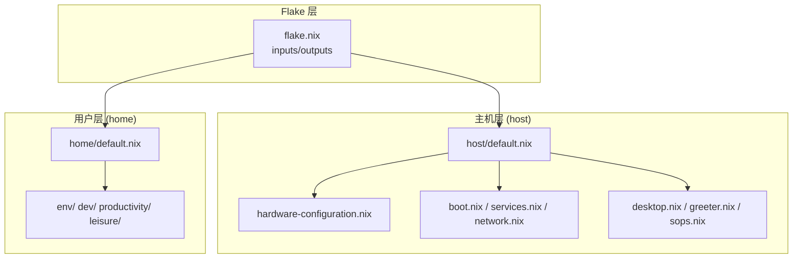
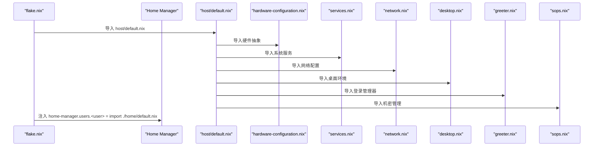
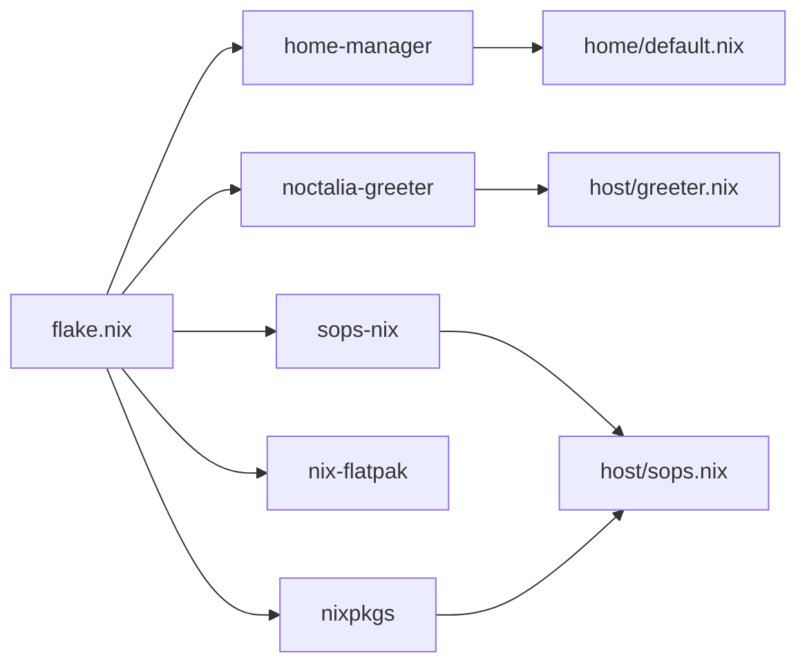

# 系统架构总览

## 目录
1. [简介](#简介)
2. [分层结构](#分层结构)
3. [模块导入机制](#模块导入机制)
4. [外部输入集成](#外部输入集成)
5. [声明式优势](#声明式优势)
6. [相关链接](#相关链接)

## 简介

本仓库是基于 NixOS Flake + Home Manager 的个人桌面配置，采用「主机配置模块（`host/`）+ 用户配置模块（`home/`）」的分层设计。系统级层面通过声明式配置管理硬件抽象、启动参数、服务、网络、桌面环境、输入法、代理与生物识别；用户级层面通过 Home Manager 管理工具链、编辑器、终端、开发环境与娱乐应用。

`flake.nix` 集中管理外部输入（`nixpkgs`、`home-manager`、`noctalia`、`sops-nix` 等），以模块化方式组合 `host` 与 `home`，实现可复现、可回滚、可审计的系统构建。

## 分层结构

整体架构以 Flake 为中心，组织两大层次：

- 顶层 `flake.nix` 通过 `nixpkgs.lib.nixosSystem` 创建系统配置，并注入 `specialArgs`（`inputs`），供各模块访问外部依赖。
- `host/default.nix` 作为系统配置聚合点，导入硬件抽象与功能子模块，形成「基础设施 + 能力」的清晰分层。
- `home/default.nix` 通过 Home Manager 将用户配置注入系统，按领域拆分（`env`/`dev`/`productivity`/`leisure`）。
- 外部输入以 NixOS / Home Manager 模块形式被直接导入，避免硬编码路径，提升可移植性。

## 模块导入机制

从 `flake.nix` 到 `host/default.nix` 再到子模块，是一条清晰的线性加载链：

- `flake.nix` 通过 `nixosSystem` 指定 `system`、`specialArgs`（`inherit inputs`），并将 `host/default.nix` 与外部模块（`sops-nix`、`noctalia-greeter`、`home-manager`）加入 `modules` 列表。
- `host/default.nix` 用 `imports` 依次导入硬件、引导、服务、网络、桌面、登录器、游戏、容器、SOPS 等子模块。
- `home/default.nix` 同样通过 `imports` 汇总用户配置，并设置用户名、家目录、`stateVersion` 等元信息。

导入均为单向，未发现显式循环依赖。`host/default.nix` 高内聚地聚合子系统模块，降低了 `flake.nix` 的复杂度。

## 外部输入集成

Flake 声明的关键输入及其角色：

- `nixpkgs`：基础包集合与 NixOS 模块来源。
- `home-manager`：用户态配置框架。
- `noctalia` / `noctalia-greeter`：桌面壳与登录管理器。
- `sops-nix`：机密管理与注入。
- `nix-flatpak`：Flatpak 集成。
- `llm-agents` / `codex-desktop-linux`：AI 与桌面工具（已声明，按需引用）。

模块耦合关系：`network.nix` 强依赖 `sops-nix.service`（`after`/`wants`），确保机密可用后再启动 mihomo；`desktop.nix` 依赖输入法、字体、Portal、终端等子系统。

## 声明式优势

- **可复现**：Flake 锁定版本，保证跨时间、跨机器的构建一致性。
- **可回滚**：每次切换生成新代次，失败可快速回退（配合 btrfs 快照）。
- **可审计**：变更集中在配置文件，便于审查与追踪。
- **可维护**：模块按 `host`/`home` 拆分，职责单一；外部输入统一由 Flake 管理，升级降级可控。

## 相关链接

- [Flake 配置管理](flake.md)
- [主机系统架构与启动流程](host.md)
- [项目概述](../overview.md)
- 为何锁定 unstable 频道：[../../memory/cards/flake-unstable-strategy.md](../../memory/cards/flake-unstable-strategy.md)
