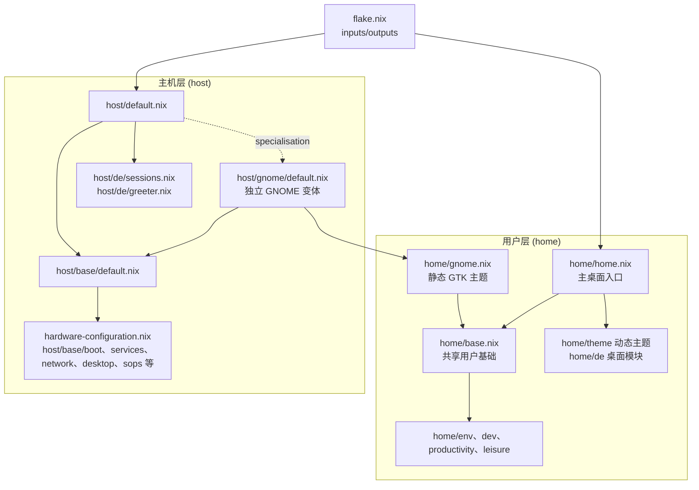
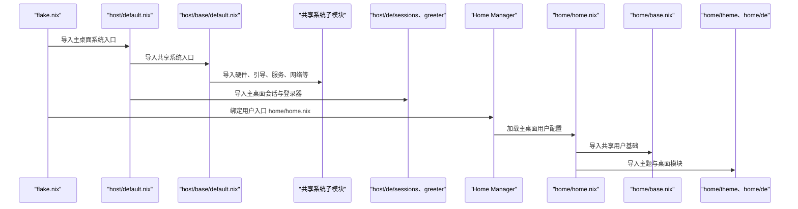
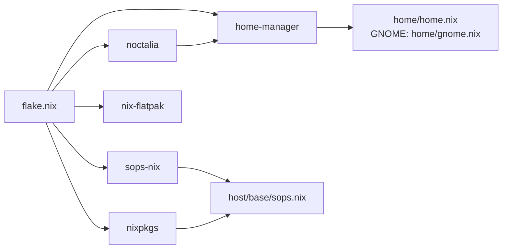

# 系统架构总览

## 目录
1. [简介](#简介)
2. [分层结构](#分层结构)
3. [模块导入机制](#模块导入机制)
4. [外部输入集成](#外部输入集成)
5. [声明式优势](#声明式优势)
6. [相关链接](#相关链接)

## 简介

本仓库是基于 NixOS Flake + Home Manager 的个人桌面配置，采用「主机配置模块（`host/`）+ 用户配置模块（`home/`）」的分层设计。系统级层面通过声明式配置管理硬件抽象、启动参数、服务、网络、桌面环境、输入法、代理与生物识别；用户级层面通过 Home Manager 管理工具链、编辑器、终端、开发环境与娱乐应用。

`flake.nix` 集中管理外部输入（`nixpkgs`、`home-manager`、`noctalia`、`sops-nix` 等），以模块化方式组合 `host` 与 `home`，实现可复现、可回滚、可审计的系统构建。

## 分层结构

整体架构以 Flake 为中心，组织两大层次：

- 顶层 `flake.nix` 通过 `nixpkgs.lib.nixosSystem` 创建系统配置，并注入 `specialArgs`（`inputs`），供各模块访问外部依赖。
- `host/default.nix` 组合共享系统入口 `host/base/default.nix` 与主桌面的 `host/de/` 会话、登录器配置；GNOME 使用独立入口 `host/gnome/default.nix`。
- 主桌面用户入口是 `home/home.nix`，组合共享 `home/base.nix`、主题与桌面模块；GNOME 入口 `home/gnome.nix` 组合共享基础与静态 GTK 主题。共享基础按 `env`/`dev`/`productivity`/`leisure` 拆分。
- 外部输入以 NixOS / Home Manager 模块形式被直接导入，避免硬编码路径，提升可移植性。

```mermaid
graph TB
F["flake.nix<br/>inputs/outputs"]
subgraph "主机层 (host)"
H1["host/default.nix"]
HB["host/base/default.nix"]
HC["hardware-configuration.nix<br/>host/base/boot、services、network、desktop、sops 等"]
HD["host/de/sessions.nix<br/>host/de/greeter.nix"]
HG["host/gnome/default.nix<br/>独立 GNOME 变体"]
end
subgraph "用户层 (home)"
U1["home/home.nix<br/>主桌面入口"]
UB["home/base.nix<br/>共享用户基础"]
UC["home/env、dev、productivity、leisure"]
UD["home/theme 动态主题<br/>home/de 桌面模块"]
UG["home/gnome.nix<br/>静态 GTK 主题"]
end
F --> H1
H1 --> HB
HB --> HC
H1 --> HD
H1 -. specialisation .-> HG
HG --> HB
F --> U1
U1 --> UB
UB --> UC
U1 --> UD
HG --> UG
UG --> UB
```

## 模块导入机制

系统与用户配置分别按入口组合共享基础和桌面专属模块：

- `flake.nix` 通过 `nixosSystem` 指定 `system`、`specialArgs`（`inherit inputs`），并将 `host/default.nix` 与外部模块（`sops-nix`、`home-manager`）加入 `modules` 列表。
- `host/default.nix` 直接导入 `host/base/default.nix`、`host/de/sessions.nix` 和 `host/de/greeter.nix`；硬件、引导、服务、网络、容器、SOPS 等共享模块由 `host/base/default.nix` 汇总。
- Home Manager 主入口 `home/home.nix` 导入 `home/base.nix`、主题与桌面模块；`home/base.nix` 汇总共享用户配置，并设置用户名、家目录、`stateVersion` 等元信息。

```mermaid
sequenceDiagram
participant FL as "flake.nix"
participant HD as "host/default.nix"
participant HB as "host/base/default.nix"
participant BC as "共享系统子模块"
participant DE as "host/de/sessions、greeter"
participant HM as "Home Manager"
participant HH as "home/home.nix"
participant UB as "home/base.nix"
participant UD as "home/theme、home/de"
FL->>HD : 导入主桌面系统入口
HD->>HB : 导入共享系统入口
HB->>BC : 导入硬件、引导、服务、网络等
HD->>DE : 导入主桌面会话与登录器
FL->>HM : 绑定用户入口 home/home.nix
HM->>HH : 加载主桌面用户配置
HH->>UB : 导入共享用户基础
HH->>UD : 导入主题与桌面模块
```

导入均为单向，未发现显式循环依赖。`host/default.nix` 高内聚地聚合子系统模块，降低了 `flake.nix` 的复杂度。

## 外部输入集成

Flake 声明的关键输入及其角色：

- `nixpkgs`：基础包集合与 NixOS 模块来源。
- `home-manager`：用户态配置框架。
- `noctalia`：桌面壳（Quickshell 面板）。
- `sops-nix`：机密管理与注入。
- `nix-flatpak`：Flatpak 集成。
- `codex-desktop-linux`：Codex Desktop 的桌面发行来源。

模块耦合关系：`network.nix` 强依赖 `sops-install-secrets.service`（`after`/`wants`），确保机密可用后再启动 mihomo；`desktop.nix` 依赖输入法、字体、Portal、终端等子系统。

```mermaid
graph LR
FL["flake.nix"] --> HM["home-manager"]
FL --> NC["noctalia"]
FL --> SN["sops-nix"]
FL --> NF["nix-flatpak"]
FL --> NP["nixpkgs"]
HM --> HOME["home/home.nix<br/>GNOME: home/gnome.nix"]
SN --> HOST["host/base/sops.nix"]
NC --> HM
NP --> HOST
```

## 声明式优势

- **可复现**：Flake 锁定版本，保证跨时间、跨机器的构建一致性。
- **可回滚**：每次切换生成新代次，失败可快速回退（配合 btrfs 快照）。
- **可审计**：变更集中在配置文件，便于审查与追踪。
- **可维护**：模块按 `host`/`home` 拆分，职责单一；外部输入统一由 Flake 管理，升级降级可控。

## 相关链接

- [Flake 配置管理](flake.md)
- [主机系统架构与启动流程](host.md)
- [项目概述](../overview.md)
- 为何锁定 unstable 频道：[../../memory/cards/flake-unstable-strategy.md](../../memory/cards/flake-unstable-strategy.md)
