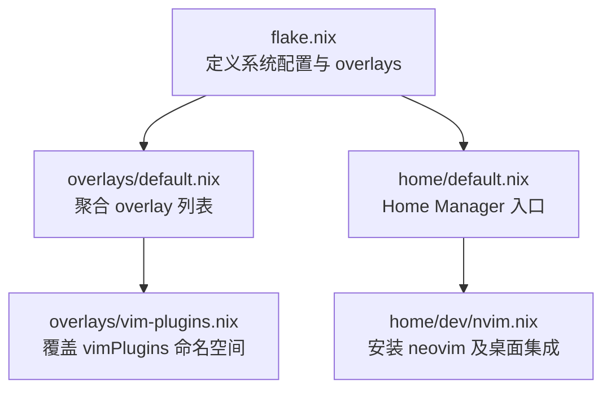
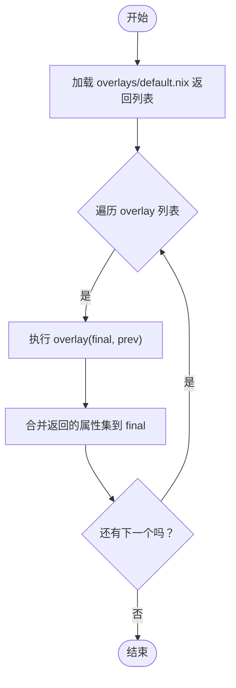

# Overlay 系统

Overlay 是 nixpkgs 的"补丁层"——不改上游源码就能替换、扩展或新增包定义。本仓库当前只用最小化 overlay：给 Neovim 插件命名空间加一个别名。本文说明 overlay 怎么加载、怎么写，以及**什么时候该用 overlay、什么时候该用别的方式**。

## 结构

- `flake.nix` — 通过 `nixpkgs.overlays = import ./overlays` 挂载 overlay 列表。
- `overlays/default.nix` — 把各个 overlay 函数聚成一个列表。
- `overlays/vim-plugins.nix` — 针对 `vimPlugins` 的一个 overlay。



## 加载机制

- **加载位置**：`flake.nix` 指定 overlays 目录，`overlays/default.nix` 必须返回一个 overlay 函数列表。
- **执行顺序**：nixpkgs 依次执行列表里的函数，形参 `(final, prev)` 表示"最终结果"和"上一阶段结果"。后执行的 overlay 能看到先执行的结果（通过 `prev`），可覆盖同名属性。
- **作用范围**：overlay 作用于整个 nixpkgs 属性集。只想影响某个子树（如 `vimPlugins`）时，要在 overlay 内精准定位并基于 `prev` 合并。



## 本仓库的实现

`overlays/default.nix` 只挂了一个 overlay：

```nix
[
  (import ./vim-plugins.nix)
]
```

`overlays/vim-plugins.nix` 基于 `prev.vimPlugins` 合并，加一个别名 `nvim-treesitter-legacy` 指向现有插件：

```nix
(final: prev: {
  vimPlugins = prev.vimPlugins // {
    nvim-treesitter-legacy = prev.vimPlugins.nvim-treesitter;
  };
})
```

好处：无需改动上游包定义即可引入兼容别名，便于后续切换版本或迁移。overlay 只改 nixpkgs 里的包定义，实际安装由 `home/dev/nvim.nix`（Home Manager）决定。

## 何时用 overlay（选择规则）

三种改包方式各有边界，别混用（详见[约束与惯例](../constraints.md)）：

**用 `nixpkgs.overlays`——仅当：**
- 要给一个已有 attrset 加名字，且其他模块通过 `pkgs.*` 引用它（如 `pkgs.vimPlugins.some-alias`）；
- 被改的包还被其他包依赖，那些包也必须看到新版本。

**用内联 `overrideAttrs`（不进 overlay）——当：**
- 只在一个地方给某个包打补丁；
- 这个包没有需要感知改动的反向依赖。

**用 `local-deriv/*.nix` + 直接 import——当：**
- 定义一个 nixpkgs 里没有的全新包；
- 写法：`(import ../local-deriv/foo.nix { inherit pkgs; })`；需要 `assets/` 路径时把 `src` 作为参数传入。

**绝不**把全新包定义塞进 `flake.nix` 的 `nixpkgs.overlays` 里。一句话：overlay 是为"要被 `pkgs.*` 全局引用/被反向依赖看见"的改动准备的，其余优先用 `overrideAttrs` 或本地派生。

## 新增自定义 overlay

1. 在 `overlays/` 下新建 `.nix`，导出 `(final, prev) -> { ... }` 函数。
2. 明确覆盖的属性路径（`vimPlugins`、`python3Packages` 等），优先基于 `prev` 合并，避免破坏上游依赖图。
3. 在 `overlays/default.nix` 把新 overlay 加入列表。
4. 查询 `pkgs.*` 对应属性确认生效。

多个 overlay 覆盖同一属性时，后执行的优先级更高，可通过调整列表顺序控制结果。

## 故障排查

- **overlay 没生效**：确认 `flake.nix` 已设 `nixpkgs.overlays`，且 `overlays/default.nix` 返回的是函数列表。
- **验证别名**：查询 `pkgs.vimPlugins.nvim-treesitter-legacy` 是否存在并指向预期插件。
- **隔离测试**：临时注释某个 overlay，看问题是否消失，缩小范围。
- **依赖冲突**：查看完整构建日志定位版本不一致。

## 相关链接

- [约束与惯例](../constraints.md) — overlay / override / local-deriv 的完整选择规则
- [wiki 首页](../README.md)
- [nix-search-before-manual](../../memory/cards/nix-search-before-manual.md) — 手搓包/覆盖前先多路径查官方模块
