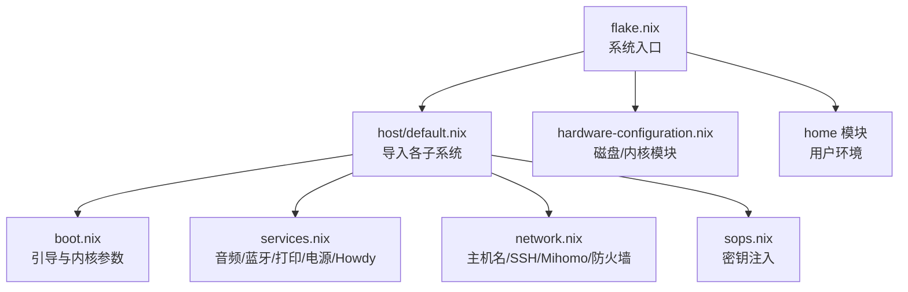
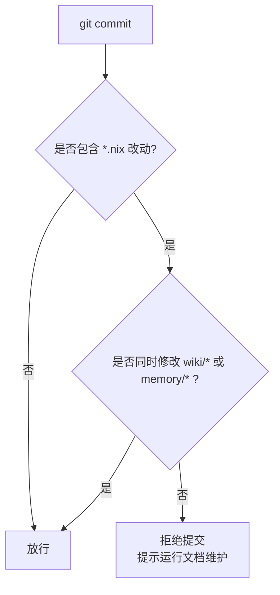

# 部署与维护

NixOS + Home Manager + Flake 的完整运维闭环：新机部署、日常 rebuild、密钥管理、升级回滚与备份恢复。所有变更通过 `nixos-rebuild` 声明式应用，确保可复现、可回滚。

## 目录

1. [仓库结构](#仓库结构)
2. [日常 rebuild](#日常-rebuild)
3. [新机首次部署](#新机首次部署)
4. [密钥与持久化](#密钥与持久化)
5. [升级与回滚](#升级与回滚)
6. [备份与灾难恢复](#备份与灾难恢复)
7. [文档同步门禁](#文档同步门禁)
8. [故障排查](#故障排查)
9. [相关链接](#相关链接)

## 仓库结构



- 系统级配置在 `host/`（引导、硬件、网络、服务、桌面、游戏等）。
- 用户级配置在 `home/`（开发、生产力、娱乐、主题）。
- 存储为 btrfs 多子卷（`@`、`@home`、`@nix`、`@persist`、`@log`）+ 独立 vfat `/boot` + swap。
- `wiki/` 记录「怎么用」，`memory/` 记录「为什么」。

## 日常 rebuild

```bash
cd ~/myNixOSConfig && sudo nixos-rebuild switch --flake .
```

- 用户级改动无需 sudo，rebuild 自动处理；系统级变更需相应权限。
- 所有改动必须通过 `nixos-rebuild` 应用，禁止非 nix 方式修改系统。
- secrets 走 `/persist/secrets/`，不进 git。

## 新机首次部署

1. **获取仓库**：`git clone <repo-url> ~/myNixOSConfig`。
2. **生成硬件配置**：`nixos-generate-config --root /mnt`，将 `hardware-configuration.nix` 复制到仓库根（自动生成，勿手改）。
3. **改机器特定项**：主机名/时区/locale/用户（`host/`）、`home.username` 与 `home.homeDirectory`（`home/default.nix`）、显示器（`home/env/hyprland.nix`）、`nixosConfigurations.<hostname>`（`flake.nix`）。
4. **准备 `/persist` 子卷**：
   ```bash
   sudo mkdir -p /persist/mihomo
   sudo cp <your-mihomo-config.yaml> /persist/mihomo/config.yaml
   age-keygen -o /persist/sops-age-key.txt   # sops-nix age 私钥
   ```
5. **应用配置**：`sudo nixos-rebuild switch --flake ~/myNixOSConfig#`。
6. **首次认证**：终端运行 `onedrive` 完成 OAuth；确认 `/persist/mihomo/config.yaml` 订阅链接有效。

> MS CJK 字体从 Windows 授权副本提取，存放 `/persist/Fonts/`（不进 git），每次 rebuild 由 `home.activation.copyMsCjkFonts` 复制到用户字体目录。首次部署需手动提取字体文件。

## 密钥与持久化

- Secrets 通过 sops-nix + age 加密管理，密文在 `host/secrets/secrets.yaml`，age 私钥在 `/persist/sops-age-key.txt`。
- `host/sops.nix` 指定私钥路径与默认加密文件，按需注入敏感环境变量（如 `mihomo_env`）。
- 更新 `secrets.yaml` 后需重新 rebuild 生效。

## 升级与回滚

- 使用 unstable 通道获取最新包；`flake.lock` 锁定依赖版本便于回滚，必要时在 `flake.nix` 中 pin 特定 commit。
- 升级流程：拉取仓库 → `nixos-rebuild switch --flake .` → 重启验证关键服务（网络、代理、桌面、生物识别）。
- 出问题回滚：`sudo nixos-rebuild switch --rollback` 或在引导菜单选择上一代。
- 关注内核/驱动回归（如 amdgpu 亮度曲线，已在 `host/boot.nix` 规避）与第三方模块（noctalia、sops-nix、home-manager）兼容说明。

## 备份与灾难恢复

- **备份范围**：`/persist` 子卷（mihomo 配置、sops 密钥、字体、用户数据）、仓库源码、`/boot`。
- **策略**：利用 btrfs 快照 + `send/receive` 做增量，结合 systemd timer 定期执行，推送异地（如 OneDrive）。
- **恢复步骤**：安装基础 NixOS → 恢复 `/persist` 与仓库（确保 `hardware-configuration.nix` 匹配硬件）→ 恢复 age 私钥权限 → `nixos-rebuild switch --flake .` → 验证 mihomo/OneDrive/Howdy/网络。

## 文档同步门禁

仓库以双机制防止「只改代码不改文档」的漂移：



- Commit 门禁：`.claude/hooks/check-doc-sync.sh` 在 PreToolUse 拦截 git commit，若仅改 `*.nix` 而未动 wiki/memory 则拒绝。
- 会话收尾：`session-wrapup` skill 回顾决策沉淀到 memory 卡并核查 wiki 一致性。

## 故障排查

- **无法提交（文档门禁）**：补充相关 wiki/memory 后再提交。
- **mihomo 无法启动**：确认 `/persist/mihomo/config.yaml` 存在；确认 sops-nix 已注入环境变量；检查 preStart 渲染结果。
- **屏幕亮度异常（全黑）**：确认内核参数 `amdgpu.dcdebugmask` 已启用位屏蔽。
- **Howdy 无法识别**：确认视频设备路径、PAM 集成与权限。
- **普通用户无法 rebuild**：检查 sudo 白名单与用户组。

## 相关链接

- [系统服务](services.md) — 服务生命周期与命令
- [Mihomo 代理](networking/mihomo.md) — 代理配置与首次部署要点
- [故障排除总览](troubleshooting.md)
- memory：[flake-unstable-strategy](../memory/cards/flake-unstable-strategy.md)、[docs-sync-automation](../memory/cards/docs-sync-automation.md)
