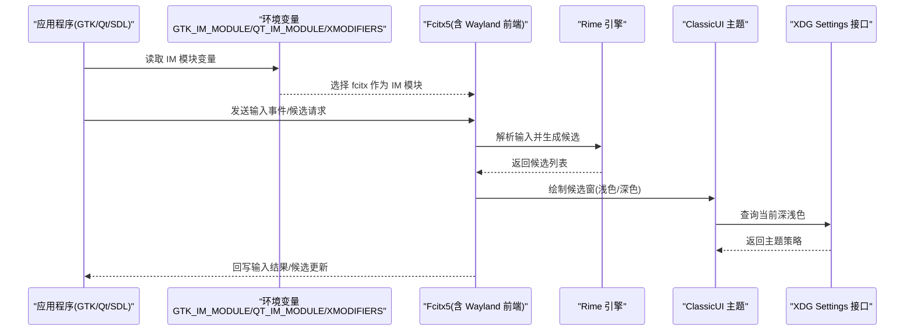
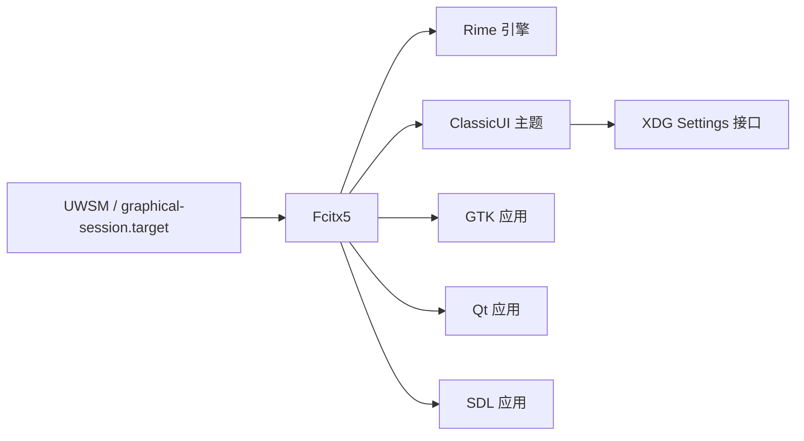

# Fcitx5 输入法框架

本文说明本仓库如何在 NixOS + Home Manager 下启用并集成 Fcitx5：引擎与主题管理、中文输入方案、Wayland 主桌面集成、候选窗定制与常见排障。核心 + 变体差异集中在系统级 `host/base/desktop.nix`；主桌面（Hyprland/niri）使用 ClassicUI，GNOME 走 kimpanel。

## 目录
1. [快速上手](#快速上手)
2. [系统级配置要点](#系统级配置要点)
3. [引擎与中文输入方案](#引擎与中文输入方案)
4. [主题与候选窗定制](#主题与候选窗定制)
5. [桌面集成与崩溃自恢复](#桌面集成与崩溃自恢复)
6. [架构总览](#架构总览)
7. [故障排查](#故障排查)
8. [配置速查](#配置速查)
9. [相关链接](#相关链接)

## 快速上手
Fcitx5 在系统构建后即随会话启动，无需额外操作：

- 应用通过环境变量自动接入 fcitx（GTK/Qt/SDL 统一）。
- `i18n.inputMethod` 安装 Fcitx5 及 addons，并提供 XDG autostart desktop entry。
- UWSM 激活图形会话后，`systemd-xdg-autostart-generator` 将其转换为用户单元 `app-org.fcitx.Fcitx5@autostart.service`。
- 使用桌面环境快捷键（如 `Super+Space`）在中英文/输入法间切换。
- 首次使用建议运行 `fcitx5-configtool` 检查方案与顺序。

查看进程和日志：

```bash
systemctl --user status app-org.fcitx.Fcitx5@autostart.service
journalctl --user -u app-org.fcitx.Fcitx5@autostart.service
```

## 系统级配置要点
系统层在 `host/base/desktop.nix` 中完成以下工作：

- Host 层提供跨桌面的 `QT_IM_MODULE=fcitx` 与 `XMODIFIERS=@im=fcitx`。
- 主桌面 HM 配置补充 `GTK_IM_MODULE=fcitx` 与 `SDL_IM_MODULE=fcitx`；GNOME 保持 GTK 原生 Wayland text-input-v3。
- 启用 `i18n.inputMethod`，`type = "fcitx5"`，并开启 `fcitx5.waylandFrontend = true` 以获得 Wayland 下更好的兼容性与性能。
- 安装插件与主题包（见下文）。
- `org.freedesktop.impl.portal.Settings` 由 Darkman 提供，供 Fcitx5 检测系统深浅色；GTK portal 继续提供文件选择等其他接口。

## 引擎与中文输入方案
中文能力由 Rime 引擎提供，在 `host/base/desktop.nix` 的 `fcitx5.addons` 中声明：

- `fcitx5-rime`，并通过 `rimeDataPkgs` 注入 `rime-ice`、`rime-moegirl`、`rime-zhwiki` 数据包。
- 核心（两 DE）：`qt6Packages.fcitx5-chinese-addons`、`qt6Packages.fcitx5-configtool`、`kdePackages.fcitx5-qt`。
- 主桌面（`lib.optionals (!gnome)`）：`fcitx5-gtk` 桥 + 主题包（mellow/material/catppuccin）。

拼音、五笔、注音等具体方案由 Rime 数据与用户方案决定；上述数据包提供基础词库能力。如需新增或切换方案，在 Rime 数据层配置即可（不在本仓库内直接体现）。

## 主题与候选窗定制
主桌面（Hyprland/niri）的 ClassicUI 系统级配置由 `host/base/desktop.nix` 生成，运行时覆盖由 `theme-apply` 写入；GNOME 候选窗由 kimpanel 扩展绘制：

- 浅色主题 `Theme = "mellow-matugen"`，深色主题 `DarkTheme = "mellow-matugen-dark"`。
- `UseDarkTheme = "True"`：让服务端 ClassicUI 通过 XDG Settings 接口跟随 Darkman。
- GTK Wayland 客户端只读取 `Theme`，因此 `theme-apply` 会写入当前模式的完整用户配置；模式切换后重启 Fcitx5。
- [`fcitx5-mellow-themes-matugen`](https://github.com/Shangshui0302/fcitx5-mellow-themes-matugen) 保留 Mellow WeChat 的圆角布局；Matugen 将 `primary` 写入两套主题的高亮 SVG，将 `on_primary` 写入高亮文字配置。
- 动态主题覆盖位于 `~/.local/share/fcitx5/themes/mellow-matugen[-dark]/`。每份 `theme.conf` 都是完整主题，而不是颜色片段；fcitx5-gtk 只加载 XDG 搜索顺序中的第一份配置，不会与 Nix profile 的基础主题合并。
- Nix 包继续提供 `panel.svg` 等静态资源和回退主题；GTK 客户端会按文件继续搜索后续 XDG data 目录，因此无需把静态资源复制到用户目录。
- `"Vertical Candidate List" = "True"`：启用垂直候选列表，更适合长词条与高分屏。

安装的主题包：`fcitx5-matugen-theme`、`fcitx5-mellow-themes`、`fcitx5-material-color`、`catppuccin-fcitx5`。

> 注意：该文件由 `theme-apply` 原子生成，不要用图形配置工具手动覆盖；完整无 section header 的格式是必要的。

## 桌面集成与崩溃自恢复
- GTK/Qt/SDL 应用均通过环境变量接入 fcitx，无需逐应用配置。
- Wayland 下启用 `waylandFrontend` 减少 X11 桥接开销。
- 在 Hyprland 下，`home/de/hyprland.nix` 为 Fcitx5 提供 systemd user service 的崩溃自恢复策略（on-failure 重启），提升长期稳定性。
- `host/de/sessions.nix` 负责 GTK Portal 注册；`home/theme-base.nix` 只负责共享字体、光标和主题基础。

## 架构总览
下图展示从应用到 Fcitx5 再到 Rime 的数据流，以及主题与 Portal 的交互路径。



依赖关系：



## 故障排查
- 输入法不显示：检查 IM 环境变量（`GTK_IM_MODULE`、`QT_IM_MODULE`、`XMODIFIERS`）是否生效；确认 Fcitx5 进程在运行，若崩溃查看 systemd user service 是否自动重启。
- 候选窗位置异常/不可见：确认 `"Vertical Candidate List"` 为 `True`（键名含空格加引号、布尔值大写）；检查 XDG Portal 的 Settings 接口可用。
- GNOME Wayland 下候选窗飞远/不跟随光标：GNOME 只实现 `text-input-v3` 无全局坐标，必须靠 kimpanel 链路。检查 fcitx5 的 kimpanel addon 未被禁用（`~/.config/fcitx5/config` 的 `[Behavior/DisabledAddons]` 不应含 kimpanel）；`host/base/desktop.nix` 已声明 `fcitx5.settings.globalOptions.Behavior.EnabledAddons = "kimpanel"` 防复发，且 GNOME kimpanel 扩展需启用。kimpanel 启用后候选窗由扩展绘制，ClassicUI 主题（mellow-matugen）不再作用于 GNOME 会话——GNOME 下候选窗跟随 Shell 主题（本机 Material-Gnome）。
- 主题不跟随深浅色或重点色：执行 `darkman get` 确认状态，再运行 `theme-apply "$(darkman get)"`；确认 `~/.local/share/fcitx5/themes/mellow-matugen[-dark]/` 下的 `highlight.svg` 和 `theme.conf` 已更新。
- GTK 应用内候选窗退回白色方框：检查用户主题的 `theme.conf` 是否包含 `[Metadata]`、`[InputPanel/Background]`、`Image=panel.svg` 和 `[InputPanel/Highlight]`。只有颜色字段的稀疏文件会遮蔽完整 Nix 主题并触发 GTK 默认样式。
- 壁纸切换后候选窗仍是旧颜色：`theme-apply` 成功后会重启 Fcitx5；检查 `systemctl --user status app-org.fcitx.Fcitx5@autostart.service`，必要时手动执行 `fcitx5-remote --check -r`。
- 候选窗样式/透明度问题：调整 ClassicUI 的 `Theme`/`DarkTheme`，并确保字体与 DPI 设置合理。

## 配置速查
- 环境变量：`GTK_IM_MODULE`/`QT_IM_MODULE`/`XMODIFIERS`/`SDL_IM_MODULE` 指向 fcitx。
- 插件与主题：`fcitx5-gtk`、`qt6Packages.fcitx5-chinese-addons`、mellow/material/catppuccin 主题包。
- Rime 数据：`rime-ice`、`rime-moegirl`、`rime-zhwiki`。
- 候选窗：`"Vertical Candidate List" = "True"`。
- 深浅色联动：`darkman set dark|light` 后由 `theme-apply` 更新 GTK 客户端配置、Matugen 重点色、重启 Fcitx5，并同步 Settings portal；切换壁纸也会重渲染两套 Fcitx5 重点色并重启服务。

## 相关链接
- 桌面深色模式与主题联动：[darkmode.md](./darkmode.md)
- Hyprland 桌面配置：[hyprland.md](./hyprland.md)
- 决策：垂直候选窗与布尔值大写等踩坑 → [fcitx5-vertical-candidates](../../memory/cards/fcitx5-vertical-candidates.md)
- 决策：Portal / gtk 悬空软链问题 → [portal-gtk-dangling-symlink](../../memory/cards/portal-gtk-dangling-symlink.md)
- 决策：TTY、UWSM 与 Fcitx5 autostart → [uwsm-kmscon-session-handoff](../../memory/cards/uwsm-kmscon-session-handoff.md)
- 决策：Darkman 状态、Matugen 渲染与 Stylix 基线 → [darkman-theme-authority](../../memory/cards/darkman-theme-authority.md)
