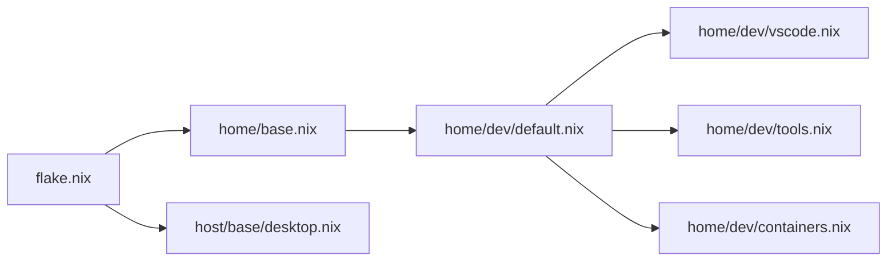
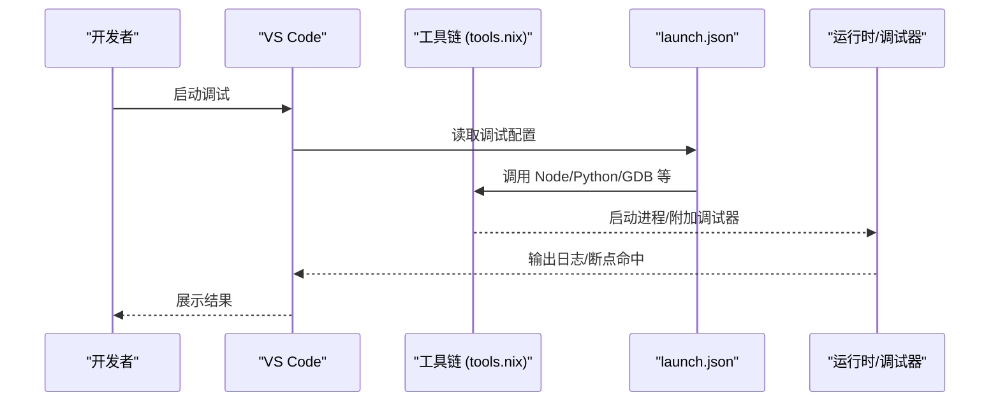

# VS Code 集成

本机 VS Code 由 Home Manager 声明式安装，模块见 `home/dev/vscode.nix`，随 `home/dev/default.nix` 一并导入。每次 rebuild 后版本一致、开箱即用，无需手动下载安装。

## 怎么装

`home/dev/vscode.nix` 只做一件事——把 `vscode` 加入用户环境：

```nix
{ pkgs, ... }:
{
  home.packages = with pkgs; [ vscode ];
}
```

要点：

- 安装由 Home Manager 统一管理，改动这个模块后 rebuild 即生效。
- 配套的工具链在 `home/dev/tools.nix`（Node.js、Python、GCC、搜索工具等），VS Code 插件生态所需的运行时基本都在这里提供。
- 容器化开发靠 `home/dev/containers.nix` 的 Distrobox 模板，配合 Remote 场景使用。
- 桌面基础设施（GNOME Keyring、Fcitx5 输入法、字体）由 `host/base/desktop.nix` 提供，保障凭据存储、中文输入与显示。

## 组件关系



- Flake 层：`flake.nix` 引入 Home Manager 并注入用户配置。
- Home Manager 层：`home/base.nix` 聚合各功能模块，`home/dev/default.nix` 再引入 vscode / tools / containers。
- 桌面层：`host/base/desktop.nix` 提供 Keyring、输入法、字体，直接影响 VS Code 的凭据与界面表现。

## 工作区配置怎么管

VS Code 本体由 Nix 管理，但工作区级配置放在项目仓库里、纳入版本控制，跨机器保持一致：

- `.vscode/settings.json` — 编辑器与语言设置
- `.vscode/tasks.json` — 构建 / 测试 / 格式化任务，复用 `tools.nix` 提供的工具路径
- `.vscode/launch.json` — 调试配置，按语言选对应调试器
- `.vscode/extensions.json` — 推荐扩展清单

敏感信息不要提交，用环境变量或 GNOME Keyring 存放。

## 调试与任务集成



- 调试器：在 `launch.json` 声明；确保 `home/dev/tools.nix` 已装好对应运行时与调试符号。
- 任务：在 `tasks.json` 定义构建 / 测试 / 格式化，复用工具链路径。
- 终端：结合 `host/base/desktop.nix` 的输入法配置获得一致交互。

## 远程与容器开发

- Remote SSH / Containers：把工作区挂到远程主机或容器。
- 容器内 toolchain 与宿主机保持一致，避免"在我机器上正常"问题；用 `home/dev/containers.nix` 的 Distrobox 模板快速搭目标环境。

## AI 辅助扩展

VS Code 常搭配 AI 辅助扩展（补全、对话）使用。本仓库的 AI CLI 工具集中在 `home/dev/ai.nix`，走统一来源与安全审查流程，见反链的 memory 卡；扩展本身在 VS Code 商店安装，与 Nix 管理的 CLI 工具互不冲突。

当前 ai.nix 管理的工具：`codex`、`codex-desktop`、`officecli`、`cc-switch`（API 路由，按需手动启动）与 `codebase-memory-mcp`（代码库知识图谱 MCP，nixpkgs 现成包）。`cc-switch` 通过 `local-deriv/cc-switch.nix` 复用 nixpkgs 构建器固定上游 v3.20.1；独立构建入口是 `nix build path:.#cc-switch`。升级时更新上游 tag 与 source、pnpm、Cargo vendor hashes，再执行 parse、build、flake check 和 `nixos-rebuild dry-build`，最后由用户手动 switch。

## 故障排查

| 现象 | 排查 |
|------|------|
| 凭据无法保存 | 确认 `host/base/desktop.nix` 已启用 GNOME Keyring，会话变量正确 |
| 中文输入异常 | 检查 Fcitx5 与 Wayland/XWayland 兼容配置 |
| 调试器不可用 | 确认 `tools.nix` 装了对应运行时且 PATH 正确 |
| 容器内行为不一致 | 核对容器镜像与宿主机 toolchain 版本 |

## 相关链接

- [Neovim](nvim.md) — 另一套由 Nix 管理的编辑器环境
- [wiki 首页](../README.md)
- [ai-tools-source](../../memory/cards/ai-tools-source.md) — AI 工具来源与安全审查决策
