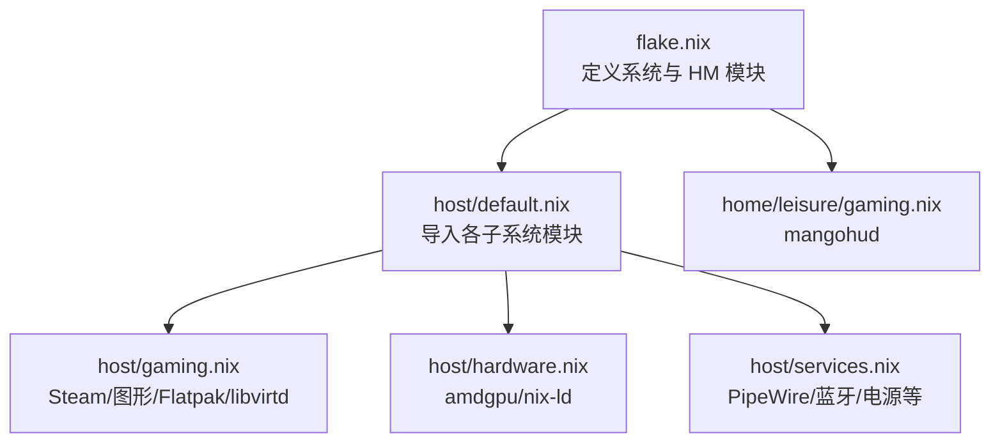

# 游戏平台

在 NixOS 上搭建游戏环境：Steam + Proton 兼容层、AMD 图形栈、手柄与音频、性能监控，以及 KVM 虚拟机运行 Windows 游戏。系统级配置在 `host/gaming.nix`，用户级工具在 `home/leisure/gaming.nix`。

## 组件总览

| 能力 | 提供者 | 说明 |
| --- | --- | --- |
| Steam 平台 | `host/gaming.nix` | 客户端 + 远程游玩防火墙 |
| 32 位图形 + 视频加速 | `host/gaming.nix` | `enable32Bit` + `libva-vdpau-driver`、`libvdpau-va-gl` |
| AMD GPU 驱动 | `host/hardware.nix` | amdgpu 内核模块与 nix-ld |
| 音频/蓝牙手柄 | `host/services.nix` | PipeWire（Pulse/ALSA/JACK）+ 蓝牙开机自启 |
| Windows 虚拟机 | `host/gaming.nix` | libvirtd + 用户加入 `libvirtd` 组 |
| 性能监控 / 录制 | `home/leisure/gaming.nix`、`home/leisure/player.nix` | mangohud、obs-studio |

## Steam 与 Proton

`programs.steam` 已启用，并打开远程游玩所需防火墙端口（`remotePlay.openFirewall`），关闭专用服务器端口暴露（`dedicatedServer.openFirewall = false`）减少攻击面。NixOS 的 Steam 模块自动集成 Proton 兼容层，运行 Windows 游戏无需额外安装。

使用建议：

- 首次运行后在 Steam「设置 → 兼容性」中开启对所有游戏启用 Proton。
- 遇到特定游戏问题，在游戏「属性 → 兼容性」中切换 Proton 版本或试用 Proton-GE。
- 有线手柄延迟更低；无线手柄通过系统蓝牙配对。

## AMD 图形栈

- `host/hardware.nix` 启用 amdgpu 内核模块，保障图形子系统正常工作。
- `host/gaming.nix` 启用 32 位图形支持，满足 Windows 游戏与工具的依赖需求。
- 额外安装 `libva-vdpau-driver` 与 `libvdpau-va-gl`，提升视频解码/编码与转码效率。
- 渲染后端优先 Vulkan（性能与延迟更佳），出现兼容性问题再回退 OpenGL。

> Hyprland 缩放与模糊效果在 AMD 上有已知兼容性问题，升级内核/驱动时留意；亮度曲线内核参数见反链 memory 卡。

## 音频与手柄

- PipeWire 作为统一后端，兼容 PulseAudio、ALSA（含 32 位）与 JACK，覆盖大多数游戏与录音场景。
- 蓝牙 `powerOnBoot`，便于无线手柄开机即连。
- Steam 内置「控制器配置」可完成按键映射与校准，支持 Xbox、PlayStation、Switch Pro 等通用 HID 手柄。

## 性能监控与录制

- `mangohud`（用户层）可在游戏中叠加显示帧率、GPU/CPU 占用与温度，快速定位瓶颈。
- `obs-studio` 用于直播与本地录制，结合 PipeWire 捕获屏幕与系统音频；高码率录制会显著占用 CPU/GPU，按硬件调整分辨率与码率。
- 将游戏安装在 SSD 上减少加载时间；卡顿时可清理着色器缓存后重启 Steam。

## Windows 虚拟机

`virtualisation.libvirtd.enable = true`，并将用户加入 `libvirtd` 组，即可用 `virt-manager` 创建管理 KVM 虚拟机。适合反作弊严格或需要原生 Windows 环境的游戏；若硬件支持，可考虑 GPU 直通获得接近原生的性能。

## 故障排查

- **Steam 无法启动/崩溃**：确认 amdgpu 驱动已加载；切换 Proton 版本；查看 Steam 日志。
- **游戏黑屏或闪退**：切换渲染后端（Vulkan/OpenGL）；更新驱动与内核；关闭冲突的 overlay 或录屏。
- **手柄无响应**：确认蓝牙已启用并配对；在 Steam 中重新映射；改用有线排除供电问题。
- **录制无声/画面异常**：在混音器中选择正确的 PipeWire 输入源；降低分辨率/码率验证。
- **性能骤降**：用 mangohud 识别瓶颈；关闭后台程序；清理着色器缓存。

## 相关链接

- [媒体播放](media.md) — 同属娱乐模块的音视频工具
- [系统服务](../services.md) — PipeWire、蓝牙、libvirtd 等系统服务
- [Hyprland 桌面](../desktop/hyprland.md) — Wayland 下的窗口与合成
- [故障排除总览](../troubleshooting.md)
- memory：[hyprland-056-blur-amd](../../memory/cards/hyprland-056-blur-amd.md)、[mechrevo-amd-backlight-curve](../../memory/cards/mechrevo-amd-backlight-curve.md)
