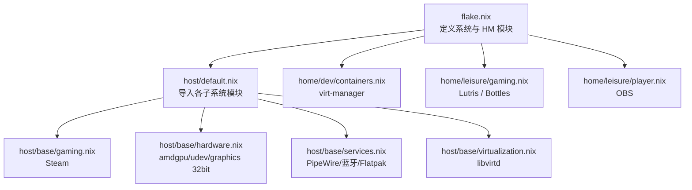

# 游戏平台

在 NixOS 上搭建游戏环境：Steam + Proton 兼容层、Lutris/Bottles 两个 Wine 前端、AMD 图形栈、手柄与音频、性能监控，以及 KVM 虚拟机运行 Windows 游戏。Steam 在 `host/base/gaming.nix`，图形栈在 `host/base/hardware.nix`，虚拟化在 `host/base/virtualization.nix`，Lutris/Bottles 在 `home/leisure/gaming.nix`，其余用户级工具在 `home/dev/containers.nix`。

## 组件总览

```mermaid
graph TB
A["flake.nix<br/>定义系统与 HM 模块"] --> B["host/default.nix<br/>导入各子系统模块"]
B --> C["host/base/gaming.nix<br/>Steam"]
B --> D["host/base/hardware.nix<br/>amdgpu/udev/graphics 32bit"]
B --> E["host/base/services.nix<br/>PipeWire/蓝牙/Flatpak"]
B --> V["host/base/virtualization.nix<br/>libvirtd"]
A --> F["home/dev/containers.nix<br/>virt-manager"]
A --> G["home/leisure/gaming.nix<br/>Lutris / Bottles"]
A --> H["home/leisure/player.nix<br/>OBS"]
```

| 能力 | 提供者 | 说明 |
| --- | --- | --- |
| Steam 平台 | `host/base/gaming.nix` | 客户端 + 远程游玩防火墙 |
| Lutris（Windows 游戏） | `home/leisure/gaming.nix` | HM `programs.lutris` + nixpkgs Proton-GE |
| Bottles（wineprefix） | `home/leisure/gaming.nix` | `bottles`（去沙箱警告弹窗） |
| 32 位图形 + 视频加速 | `host/base/hardware.nix` | `enable32Bit` + `libva-vdpau-driver`、`libvdpau-va-gl` |
| AMD GPU 驱动 | `host/base/hardware.nix` | amdgpu 内核模块与显示驱动 |
| 音频/蓝牙手柄 | `host/base/services.nix` | PipeWire（Pulse/ALSA/JACK）+ 蓝牙开机自启 |
| Flatpak 运行时 | `host/base/services.nix` | 为用户级 Flatpak 应用提供系统运行时 |
| Windows 虚拟机 | `host/base/virtualization.nix` | libvirtd + 用户加入 `libvirtd` 组 |
| 性能叠加 / 录制 | `home/leisure/gaming.nix`、`home/leisure/player.nix` | mangohud、obs-studio |

## Steam 与 Proton

`programs.steam` 已启用，并打开远程游玩所需防火墙端口（`remotePlay.openFirewall`），关闭专用服务器端口暴露（`dedicatedServer.openFirewall = false`）减少攻击面。NixOS 的 Steam 模块自动集成 Proton 兼容层，运行 Windows 游戏无需额外安装。

使用建议：

- 首次运行后在 Steam「设置 → 兼容性」中开启对所有游戏启用 Proton。
- 遇到特定游戏问题，在游戏「属性 → 兼容性」中切换 Proton 版本或试用 Proton-GE。
- 想让 Steam 也用上 nixpkgs 的 Proton-GE，在 `host/base/gaming.nix` 加 `programs.steam.extraCompatPackages = [ pkgs.proton-ge-bin ];`（与 Lutris 共用同一份，不额外下载）。
- 有线手柄延迟更低；无线手柄通过系统蓝牙配对。

## AMD 图形栈

- `host/base/hardware.nix` 启用 amdgpu 内核模块，保障图形子系统正常工作。
- `host/base/hardware.nix` 启用 32 位图形支持，满足 Windows 游戏与工具的依赖需求。
- 额外安装 `libva-vdpau-driver` 与 `libvdpau-va-gl`，提升视频解码/编码与转码效率。
- 渲染后端优先 Vulkan（性能与延迟更佳），出现兼容性问题再回退 OpenGL。

> Hyprland 缩放与模糊效果在 AMD 上有已知兼容性问题，升级内核/驱动时留意；亮度曲线内核参数见反链 memory 卡。

## 音频与手柄

- PipeWire 作为统一后端，兼容 PulseAudio、ALSA（含 32 位）与 JACK，覆盖大多数游戏与录音场景。
- 蓝牙 `powerOnBoot`，便于无线手柄开机即连。
- Steam 内置「控制器配置」可完成按键映射与校准，支持 Xbox、PlayStation、Switch Pro 等通用 HID 手柄。

## 性能监控与录制

- `mangohud`（`home/leisure/gaming.nix` 用户层）可在游戏中叠加显示帧率、GPU/CPU 占用与温度；Steam 里用 `mangohud %command%` 启动，Lutris/Bottles 各有自己的 MangoHud 开关（其沙箱内也已带一份）。
- `obs-studio` 用于直播与本地录制，结合 PipeWire 捕获屏幕与系统音频；高码率录制会显著占用 CPU/GPU，按硬件调整分辨率与码率。
- 将游戏安装在 SSD 上减少加载时间；卡顿时可清理着色器缓存后重启 Steam。

## Lutris 与 Bottles

两者都是 Windows 游戏 / wineprefix 前端，声明在 `home/leisure/gaming.nix`：Lutris 用 Home Manager 的 `programs.lutris`，Bottles 用 `pkgs.bottles`（`removeWarningPopup = true`）。nixpkgs 给两者的都是 **FHS 沙箱包装**（`multiArch`），下载来的 Wine/Proton runner 在沙箱里执行，因此**不需要** `steam-run lutris` 这类外层包裹，也不必额外配动态链接器。

- **Lutris**：右上角 `+` 添加游戏；`Preferences → Runners` 里选 runner。Wine 版本列表里能看到 nixpkgs 打包的 Proton-GE（按小写目录名列出，含 32 位），也可以用列表里的下载按钮取上游 GE 版本。
- **Bottles**：首次启动按向导新建 bottle，会从 GitHub 取 Soda runner 与 DXVK/vkd3d 组件。
- 两者都提供 MangoHud / Gamescope 开关；Lutris 侧需要的可执行文件由 `programs.lutris.extraPackages` 放进沙箱。GameMode 的守护进程默认未启用（见故障排查）。

| 事项 | 路径 |
| --- | --- |
| Lutris 数据 / 配置 | `~/.local/share/lutris`、`~/.config/lutris` |
| Lutris 的 wine 与 Proton-GE | 由 HM 链接自 nixpkgs，位于 `~/.local/share/lutris/runners/wine` |
| Bottles 数据 | `~/.local/share/bottles` |

> 历史：曾用 Flatpak 版 Bottles 并为其离线索引做过改造（见 [Bottles 离线韧性改造](../dev/bottles-offline-workaround.md)）。改用 nixpkgs 版后不需要那套 `file://` 修补；旧数据仍在 `~/.var/app/com.usebottles.bottles`，如需沿用把其中的 `data/bottles` 拷到 `~/.local/share/bottles` 即可。

## Windows 虚拟机

`host/base/virtualization.nix` 的 `virtualisation.libvirtd.enable = true`，并将用户加入 `libvirtd` 组；用户级 `home/dev/containers.nix` 提供 `virt-manager` 创建和管理 KVM 虚拟机。适合反作弊严格或需要原生 Windows 环境的游戏；若硬件支持，可考虑 GPU 直通获得接近原生的性能。

## 故障排查

- **Steam 无法启动/崩溃**：确认 amdgpu 驱动已加载；切换 Proton 版本；查看 Steam 日志。
- **游戏黑屏或闪退**：切换渲染后端（Vulkan/OpenGL）；更新驱动与内核；关闭冲突的 overlay 或录屏。
- **手柄无响应**：确认蓝牙已启用并配对；在 Steam 中重新映射；改用有线排除供电问题。
- **录制无声/画面异常**：在混音器中选择正确的 PipeWire 输入源；降低分辨率/码率验证。
- **性能骤降**：用 mangohud 识别瓶颈；关闭后台程序；清理着色器缓存。
- **winetricks 的 GUI 打不开，报 `libadwaita-1.so.0: cannot open shared object file`**：Lutris 沙箱里的 zenity 是 GTK4 版而缺库（[nixpkgs#410677](https://github.com/NixOS/nixpkgs/issues/410677)）；配置已把 `gtk4`/`libadwaita` 放进 `programs.lutris.extraPackages` 规避，若仍失败就在终端里直接跑 `winetricks`。
- **Lutris 提示 `libattr.so.1: version 'ATTR_1.3' not found`**：Lutris 自带 runtime 与系统库冲突，`Preferences → Global Options` 勾上 `Disable Lutris Runtime` 后重装游戏。
- **Bottles 下载 runner / 依赖失败**：组件索引托管在 `proxy.usebottles.com`，经代理可能连不通；给 mihomo 加 `DOMAIN-SUFFIX,usebottles.com,DIRECT` 再重试（历史方案见 [Bottles 离线韧性改造](../dev/bottles-offline-workaround.md)）。
- **Bottles 首次启动提示「不支持非沙箱环境」**：上游只保证 Flatpak 版，nixpkgs 版已用 `removeWarningPopup` 去掉该弹窗，功能不受影响。
- **想要「只在游戏时提性能」**：本配置不用 gamemode，且**不使用 TLP 的 profile hold**（`tlpctl launch -p ...`），所以没有「进程退出自动释放」，需要手动切档：游戏前用 `power-actions mode performance`（等价 `tlpctl set performance`）切到性能档，结束后 `power-actions mode balanced`（或 `tlpctl set balanced`）切回。自动档位与核显 DPM 联动见 [系统服务](../services.md#电源与存储维护)。Wine 的 fsync 不受影响；esync 所需的文件描述符上限实测会话已是 `524288/524288`，无需再调 `pam` 限制。

## 相关链接

- [媒体播放](media.md) — 同属娱乐模块的音视频工具
- [Bottles 离线韧性改造（历史）](../dev/bottles-offline-workaround.md) — Flatpak 版时代的索引接管方案
- [系统服务](../services.md) — PipeWire、蓝牙、libvirtd 等系统服务
- [Hyprland 桌面](../desktop/hyprland.md) — Wayland 下的窗口与合成
- [故障排除总览](../troubleshooting.md)
- memory：[hyprland-056-blur-amd](../../memory/cards/hyprland-056-blur-amd.md)、[mechrevo-amd-backlight-curve](../../memory/cards/mechrevo-amd-backlight-curve.md)、[wine-frontends-nixpkgs-fhs](../../memory/cards/wine-frontends-nixpkgs-fhs.md)
