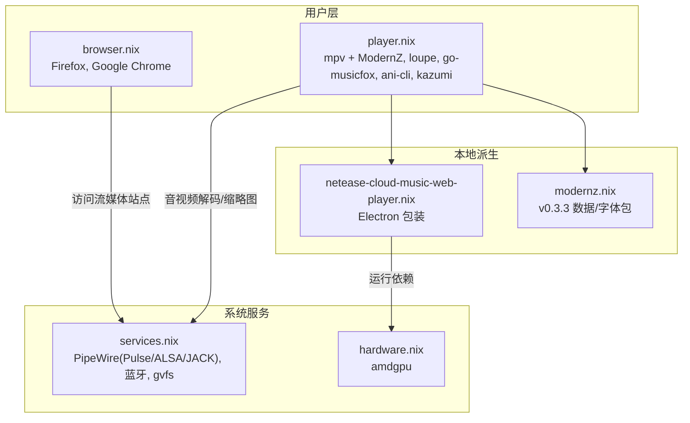

# 媒体播放

用户级媒体环境：视频/图片查看、音乐播放、动漫客户端与在线流媒体。媒体应用在 `home/leisure/player.nix` 安装；文件管理器缩略图工具跟随 `home/productivity/files.nix`。音频与图形运行时由 `host/base/services.nix`（PipeWire）与 `host/base/hardware.nix`（amdgpu）支撑。

## 组件总览

`home/leisure/player.nix` 安装的应用：

| 应用 | 用途 |
| --- | --- |
| `mpv` + ModernZ | 通用视频/音频播放器；ModernZ 提供 Material 风格 OSC 控件 |
| `loupe` | GNOME 图片查看器 |
| `go-musicfox` | 终端网易云音乐播放器（附桌面入口 `foot -e musicfox`） |
| `obs-studio` | 直播与本地录制 |
| `ani-cli` | 命令行动漫搜索与播放，默认调用 mpv；使用 `ani-cli` 启动 |
| Kazumi | 图形化动漫聚合播放器，支持自定义规则、字幕与弹幕；由 nixpkgs 提供桌面入口 |
| 网易云网页版 | 本地派生 `local-deriv/netease-cloud-music-web-player.nix` Electron 打包 |

浏览器（Firefox、Google Chrome）在 `home/leisure/browser.nix`，用于访问 Netflix、YouTube、Bilibili 等在线流媒体。

文件管理器的图片/视频缩略图由 `home/productivity/files.nix` 中的 `ffmpegthumbnailer` 与 `tumbler` 提供；它们属于文件管理支撑包，而不是播放器本身。

## 音频与硬件加速

- PipeWire 是统一音频后端，兼容 PulseAudio、ALSA 与 JACK；蓝牙设备配对后可作为输出端。开箱即用，无需额外配置。
- 视频解码依赖 amdgpu 驱动与 VA-API。mpv 中可启用 `hwdec=auto` 走 GPU 硬件解码，遇黑屏/卡顿再回退软件解码对比测试。
- 音效增强建议交由 PipeWire 插件（equalizer、spatializer）统一处理，关闭播放器内置音效以免冲突。

## mpv 个性化

`mpv` 使用 ModernZ 替换默认 OSC，配置由 Home Manager 写入；Lua、Material 图标字体和中文 locale 来自固定的 ModernZ release。

Matugen 会把当前壁纸生成的 Material 3 语义色写入 `~/.config/mpv/script-opts/modernz.conf`；mpv 始终使用生成的深色变体，避免桌面浅色模式下视频控件文字与画面对比不足：

- `primary`：播放进度、播放/暂停和悬停重点色。
- `surface_container`：控件/缩略图面板底色。
- `on_surface`：标题、时间和主要图标。
- `outline_variant`：边框和未播放进度。
- `layout=mini` + `seekbar_height=small`：最简控件布局与细进度条（ModernZ 上游没有 `minimal` 这个值）。

深浅色切换仍由 Darkman 驱动，但 mpv 固定读取深色 ModernZ 配置；壁纸变化会更新其 Material 3 重点色。mpv 已运行实例通常需要重新打开才能读取新 OSC 配置。

如需增加其他播放器选项，修改 `home/leisure/player.nix` 中的 `mpv.conf` 后手动 rebuild：

- `~/.config/mpv/mpv.conf`：由 Home Manager 生成，当前关闭默认 OSC 并关闭原生边框。
- `~/.config/mpv/script-opts/modernz.conf`：ModernZ 布局、按钮和颜色选项由主题链维护，不建议手动覆盖。
- 字幕：与视频同名同目录放置即可自动加载，支持 SRT/ASS/SSA/VTT；多语言场景确保系统装有相应字体。
- 播放列表与时间戳书签：通过配置文件或命令行设定循环/随机模式。

## 流媒体

- 浏览器中启用硬件加速与 DRM 组件（如 Widevine），保证受版权保护内容顺畅播放。
- Wayland 下如需更好的窗口装饰与合成，可在浏览器启动参数中启用相应特性。

## 故障排查

- **无法播放/黑屏**：确认 amdgpu 驱动已加载；切换 mpv 渲染后端或禁用硬件解码对比。
- **无声或声音异常**：确认 PipeWire 正常运行并选对输出设备；检查音量/静音，必要时重启音频服务。
- **流媒体无法播放**：确认浏览器已启用硬件加速与 DRM；检查网络与地区限制。
- **ani-cli 找不到番剧或播放失败**：检查 AniDB/源站连通性；必要时直接运行 `ani-cli` 查看交互提示。
- **Kazumi 源失效**：在应用内检查并更新自定义规则；Linux 版本依赖 WebKitGTK，规则站点变化时可能需要等待规则更新。
- **缩略图不显示**：确认 `home/productivity/files.nix` 提供的 `ffmpegthumbnailer` 与 `tumbler` 已安装且正常工作。
- **日志定位**：结合 PipeWire 日志与 mpv 日志排查。

## 相关链接

- [ModernZ](https://github.com/Samillion/ModernZ) — mpv OSC 上游项目
- [游戏平台](gaming.md) — 同属娱乐模块，共用 PipeWire/amdgpu
- [系统服务](../services.md) — PipeWire 音频栈与蓝牙
- [故障排除总览](../troubleshooting.md)
- memory：[ai-tools-source](../../memory/cards/ai-tools-source.md) — 本地派生包（AppImage/Electron）打包思路参考
