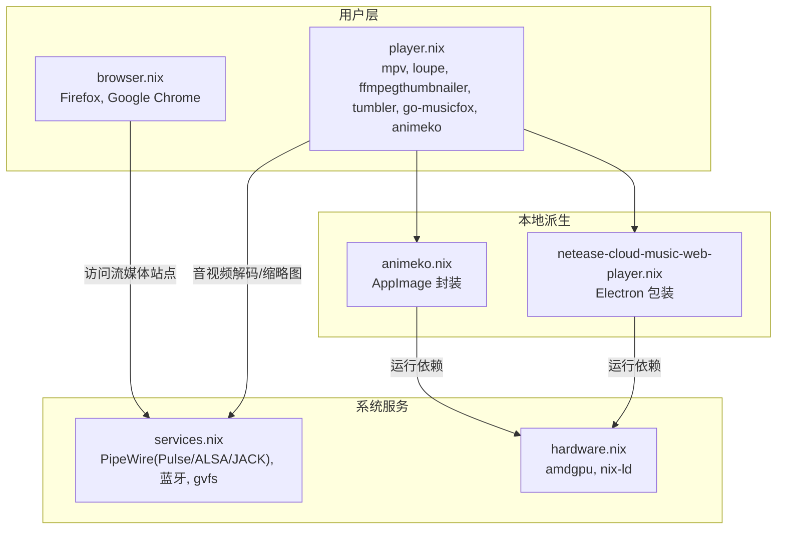

# 媒体播放

用户级媒体环境：视频/图片查看、音乐播放、动漫客户端与在线流媒体。应用在 `home/leisure/player.nix` 安装，音频与图形运行时由 `host/services.nix`（PipeWire）与 `host/hardware.nix`（amdgpu）支撑。

## 组件总览

`home/leisure/player.nix` 安装的应用：

| 应用 | 用途 |
| --- | --- |
| `mpv` | 通用视频/音频播放器 |
| `loupe` | GNOME 图片查看器 |
| `ffmpegthumbnailer` + `tumbler` | 为视频生成缩略图，供文件管理器显示 |
| `go-musicfox` | 终端网易云音乐播放器（附桌面入口 `foot -e musicfox`） |
| `obs-studio` | 直播与本地录制 |
| Animeko | 动漫播放器，本地派生 `local-deriv/animeko.nix` 封装 AppImage |
| 网易云网页版 | 本地派生 `local-deriv/netease-cloud-music-web-player.nix` Electron 打包 |

浏览器（Firefox、Google Chrome）在 `home/leisure/browser.nix`，用于访问 Netflix、YouTube、Bilibili 等在线流媒体。

## 音频与硬件加速

- PipeWire 是统一音频后端，兼容 PulseAudio、ALSA 与 JACK；蓝牙设备配对后可作为输出端。开箱即用，无需额外配置。
- 视频解码依赖 amdgpu 驱动与 VA-API。mpv 中可启用 `hwdec=auto` 走 GPU 硬件解码，遇黑屏/卡顿再回退软件解码对比测试。
- 音效增强建议交由 PipeWire 插件（equalizer、spatializer）统一处理，关闭播放器内置音效以免冲突。

## mpv 个性化（按需扩展）

仓库只安装了 mpv 包，未提供 `mpv.conf`。如需精细控制，可在用户配置目录创建：

- `~/.config/mpv/mpv.conf`：设置硬件解码、渲染后端、字幕字体与样式。
- 字幕：与视频同名同目录放置即可自动加载，支持 SRT/ASS/SSA/VTT；多语言场景确保系统装有相应字体。
- 播放列表与时间戳书签：通过配置文件或命令行设定循环/随机模式。

## 流媒体

- 浏览器中启用硬件加速与 DRM 组件（如 Widevine），保证受版权保护内容顺畅播放。
- Wayland 下如需更好的窗口装饰与合成，可在浏览器启动参数中启用相应特性。

## 故障排查

- **无法播放/黑屏**：确认 amdgpu 驱动已加载；切换 mpv 渲染后端或禁用硬件解码对比。
- **无声或声音异常**：确认 PipeWire 正常运行并选对输出设备；检查音量/静音，必要时重启音频服务。
- **流媒体无法播放**：确认浏览器已启用硬件加速与 DRM；检查网络与地区限制。
- **缩略图不显示**：确认 `ffmpegthumbnailer` 与 `tumbler` 已安装且正常工作。
- **日志定位**：结合 PipeWire 日志与 mpv 日志排查。

## 相关链接

- [游戏平台](gaming.md) — 同属娱乐模块，共用 PipeWire/amdgpu
- [系统服务](../services.md) — PipeWire 音频栈与蓝牙
- [故障排除总览](../troubleshooting.md)
- memory：[ai-tools-source](../../memory/cards/ai-tools-source.md) — 本地派生包（AppImage/Electron）打包思路参考
