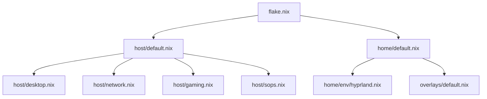
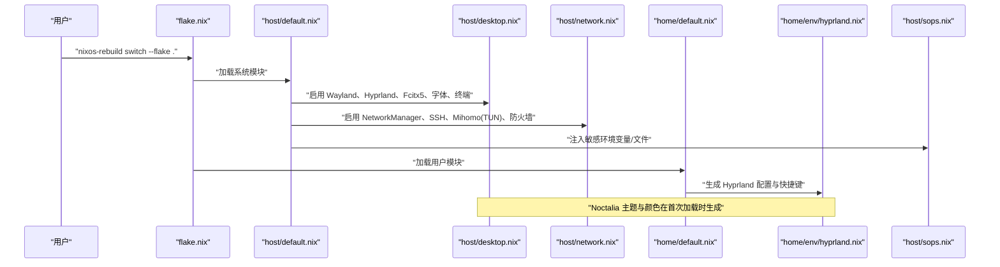

# 项目概述

## 目录
1. [简介](#简介)
2. [项目结构](#项目结构)
3. [核心组件](#核心组件)
4. [架构总览](#架构总览)
5. [快速开始](#快速开始)
6. [故障排查入口](#故障排查入口)
7. [相关链接](#相关链接)

## 简介

myNixOSConfig 是一套为机械革命（MechRevo）笔记本定制的 NixOS + Home Manager 桌面配置。目标是提供**可重现、可回滚、可审计**的桌面环境，涵盖现代开发工具链、生产力工具与娱乐功能。

技术栈以 NixOS Unstable 为基础，采用 Hyprland（Wayland 窗口管理器，主力）+ niri（滚动平铺）+ COSMIC（完整桌面环境）三种桌面，Fcitx5 + Rime 中文输入法、Noctalia 主题系统；外部依赖由 Flake 统一锁定，敏感配置通过 SOPS + age 加密管理。

仓库将「系统级」与「用户级」配置清晰分离：

- 系统基础设施位于 `host/`；
- 用户环境与应用位于 `home/`；
- `overlays/` 与 `local-deriv/` 扩展包能力；
- `wiki/` 记录「怎么用」，`memory/` 记录「为什么这么配」。

## 项目结构

仓库采用模块化组织：

- `flake.nix`：Flake 入口，定义 inputs（`nixpkgs-unstable`、`home-manager`、`noctalia`、`sops-nix` 等）与 outputs（NixOS 系统配置与 Home Manager 用户配置）。
- `host/`：系统级模块，含启动、硬件、网络、服务、桌面、Greeter、游戏、容器与安全（SOPS）。
- `home/`：用户级模块，按 `env`/`dev`/`productivity`/`leisure` 划分职责，并集成 Flatpak。
- `overlays/` 与 `local-deriv/`：对上游包进行覆盖或本地构建补充。
- `wiki/` 与 `memory/`：文档与决策记忆，辅助理解与维护。

## 核心组件

- **NixOS + Home Manager**：`flake.nix` 将系统服务与用户环境组合为可重现桌面。
- **Hyprland + Noctalia**：Wayland 下的现代窗口管理器与主题/面板生态，提供流畅交互与视觉一致性。
- **Fcitx5 + Rime**：中文输入方案，集成 GTK/Qt/SDL 前端、深色联动与垂直候选窗。
- **Mihomo（TUN 模式）**：系统级代理，结合 nftables/firewall 与 systemd 编排，提供稳定网络访问。
- **SOPS + age**：敏感信息加密与注入，密钥与环境变量安全落地。
- **游戏与虚拟化**：Steam、Flatpak、libvirtd，满足娱乐与 Windows 兼容需求。
- **AI 开发工具链**：claude-code/codex 等 agent CLI 走 llm-agents.nix 统一来源；`rtk`（token 优化）与 `codebase-memory-mcp`（代码库记忆）补齐工具链。

配置要点从对应的 nix 模块提取，详见 `host/desktop.nix`、`host/network.nix`、`host/gaming.nix`、`host/sops.nix`。

## 架构总览

从 Flake 到系统服务与用户环境的整体调用链：

系统结构分层的详细说明见 [系统架构总览](architecture/index.md)。

## 快速开始

首次在新机器上部署的核心步骤：

1. 克隆仓库并进入目录。
2. 生成硬件配置（`nixos-generate-config`）并复制到仓库根目录。
3. 修改主机名、时区、语言、用户名等机器特定项。
4. 挂载 `/persist` 子卷并放置必要的配置（如 `mihomo/config.yaml`）；sops 解密密钥用系统 SSH host key（`/etc/ssh/ssh_host_ed25519_key`），无需单独生成。
5. 执行 `sudo nixos-rebuild switch --flake .` 应用配置。
6. 首次认证 OneDrive、校验 mihomo 订阅链接。

## 故障排查入口

- Hyprland 模糊在 AMD 核显上失效：见 memory 卡片。
- Fcitx5 浅色皮肤无法激活：检查 portal-gtk 悬挂符号链接导致的 D-Bus 无法激活。
- 首次部署缺少 `/persist/mihomo/config.yaml` 或 age 密钥会导致相关服务启动失败。

## 相关链接

- [系统架构总览](architecture/index.md)
- [Flake 配置管理](architecture/flake.md)
- [主机系统架构与启动流程](architecture/host.md)
- 决策记忆索引：[../memory/INDEX.md](../memory/INDEX.md)
- 为何锁定 unstable 频道：[../memory/cards/flake-unstable-strategy.md](../memory/cards/flake-unstable-strategy.md)
