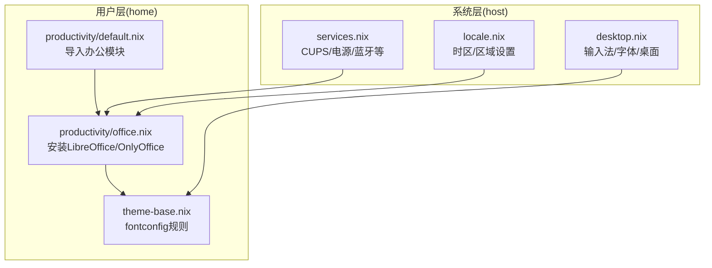
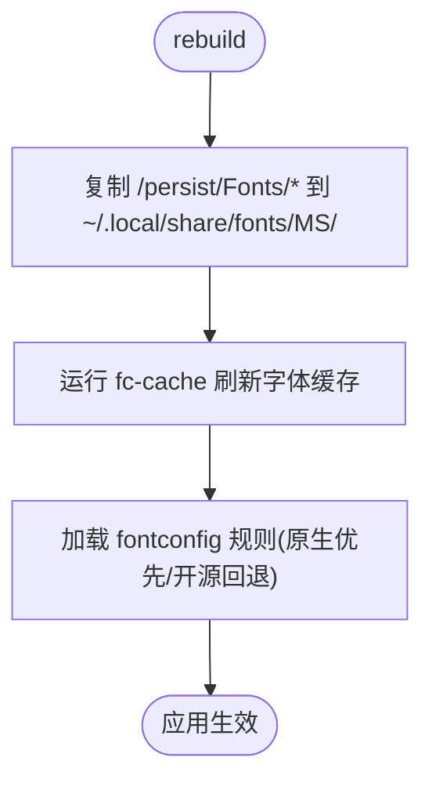

# 办公软件套件

办公应用由用户层模块 `home/productivity/office.nix` 安装，配合系统层的字体、输入法、打印服务，构成完整的中文办公环境。本文说明装了什么、CJK 字体怎么落地、以及打印 / PDF 导出与协作的用法。

## 装了什么

`home/productivity/office.nix` 通过 `home.packages` 安装：

- **LibreOffice Fresh** — 文档 / 表格 / 演示，全能主力
- **OnlyOffice Desktop Editors** — 对 MS Office 格式（docx/xlsx/pptx）兼容度高
- **笔记 / Markdown**：Obsidian、Typora、Zettlr、Ghostwriter

默认打开方式（MIME 关联）在模块里以注释形式预置。若想把 Office 格式统一默认用 OnlyOffice 打开，取消 `xdg.mimeApps` 那段注释并 rebuild 即可。

## 分层结构

系统层（`host/`）铺基础设施，用户层（`home/`）装应用：



## CJK 字体怎么落地

中文显示是办公场景的关键，字体来自三处：

- **系统开源字体**（`host/base/desktop.nix`）：WQY、Noto CJK、思源宋体/黑体、方正系列、Emoji、多种等宽字体。
- **MS 授权字体**：`office.nix` 里有一段 activation 脚本，每次 rebuild 把 `/persist/Fonts/` 下的 `.ttf`/`.ttc` 复制到 `~/.local/share/fonts/MS/` 并刷新 `fc-cache`，避免首次部署缺字。
- **fontconfig 替换链**（`home/theme-base.nix`）：实现"原生优先、开源回退"，让 Office 中英文混排更自然。



## 输入法与本地化

- **Fcitx5 + Rime**（`host/base/desktop.nix`）：GTK/Qt/X11/Wayland 多环境兼容，Office 中文输入体验一致。
- **区域设置**（`host/locale.nix`）：时区 Asia/Shanghai，语言 zh_CN.UTF-8，数字 / 日期 / 排序符合中文习惯。

## 打印与 PDF 导出

- 系统层 `host/services.nix` 启用 CUPS，为 LibreOffice/OnlyOffice 提供打印能力。
- 两者都支持"导出为 PDF"，底层依赖系统字体与渲染管线，中文排版正确的前提是字体回退链生效。
- 批量转换用无头模式命令行，例如脚本化 `docx → pdf`：

```bash
libreoffice --headless --convert-to pdf --outdir out/ *.docx
```

## 协作

- OneDrive 已在环境中启用，可做文档云端同步；重要文档放 OneDrive 目录，利用版本历史与共享链接。
- 在线协作平台（腾讯文档、飞书、Google Docs）通过系统浏览器访问，与本地 OneDrive 形成本地-云端工作流。

## 故障排查

| 现象 | 排查 |
|------|------|
| 中文字形缺失 | 确认 `/persist/Fonts/` 有授权字体，rebuild 已复制到 `~/.local/share/fonts/MS/` |
| 打印失败 / PDF 乱码 | 确认 CUPS 已启用、打印机已添加；检查中文字体回退链 |
| Office 内输入法不可用 | 确认 Fcitx5 环境变量已设，GTK/Qt 输入模块启用 |
| 首次部署找不到字体 | 重新 rebuild，让 activation 复制字体并刷新缓存 |

## 相关链接

- [wiki 首页](../README.md)
- [约束与惯例](../constraints.md) — 字体包归属 `local-deriv`、模块去重规则
- [fcitx5-vertical-candidates](../../memory/cards/fcitx5-vertical-candidates.md) — Fcitx5 输入法相关决策
