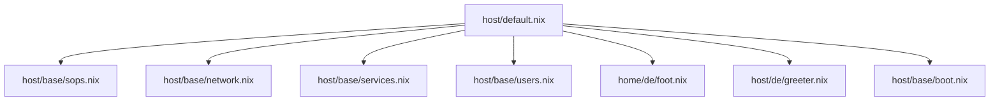
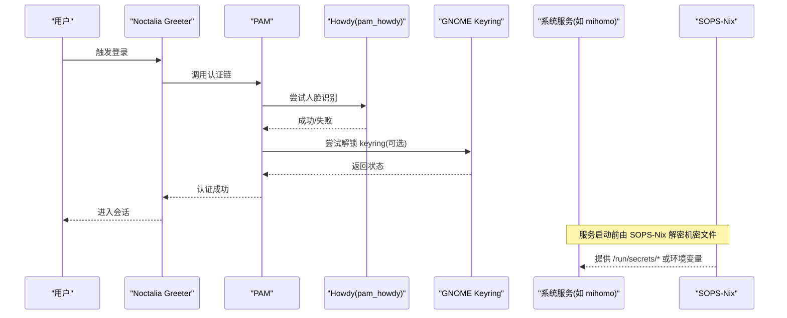

# 安全与隐私总览

本文汇总本仓库主机侧（`host/`）的安全与隐私能力，作为分主题文档的入口。涵盖机密管理、生物识别登录、权限控制、防火墙与网络、引导加固与登录界面。各能力集中在 `host/` 目录并由 `host/default.nix` 统一导入。

## 目录
1. [能力概览](#能力概览)
2. [模块分布](#模块分布)
3. [登录到凭据访问流程](#登录到凭据访问流程)
4. [机密管理（SOPS-Nix）](#机密管理sops-nix)
5. [生物识别登录与-keyring](#生物识别登录与-keyring)
6. [用户权限与访问控制](#用户权限与访问控制)
7. [防火墙与网络安全](#防火墙与网络安全)
8. [引导与文件系统加固](#引导与文件系统加固)
9. [故障排查](#故障排查)
10. [相关链接](#相关链接)

## 能力概览
- **机密管理**：SOPS-Nix + Age 加密存储敏感信息，构建期解密到 `/run/secrets/*` 供服务读取。
- **生物识别登录**：Howdy 人脸识别接入 PAM（login/sudo/su/greetd/noctalia），配合 GNOME Keyring 存储应用凭据。
- **权限控制**：wheel 组、sudo NOPASSWD 白名单、Polkit 策略。
- **网络安全**：nftables 防火墙、最小化端口开放、内核转发支撑 TUN 代理、OpenSSH。
- **引导加固**：EFI 分区严格权限掩码，降低引导区被篡改风险。

## 模块分布
| 模块 | 职责 |
| --- | --- |
| `host/base/sops.nix` | SOPS-Nix 集成、age 私钥路径、机密声明与权限 |
| `host/base/network.nix` | 网络栈、Mihomo 代理、nftables 防火墙、端口开放、内核转发 |
| `host/base/services.nix` | 系统服务、Howdy、PAM 集成、Polkit |
| `host/base/users.nix` | 用户与 sudo 白名单命令 |
| `home/de/foot.nix` | GNOME Keyring 启用与桌面集成 |
| `host/de/greeter.nix` | 登录界面（Noctalia Greeter） |
| `host/base/boot.nix` | 引导与 EFI 分区权限加固 |

## 登录到凭据访问流程
下图展示从登录到应用访问凭据的关键流程，涵盖 PAM、Howdy、Keyring 与 SOPS-Nix 注入的机密。

## 机密管理（SOPS-Nix）
`host/base/sops.nix` 通过 `age.sshKeyPaths` 指定解密密钥（SSH host key `/etc/ssh/ssh_host_ed25519_key`）并启用 `useSystemdActivation`，将 `secrets.yaml` 中的键映射为 `/run/secrets/<name>`，并设置 owner/group/mode。需要机密的服务（如 mihomo）声明 `after`/`wants` 依赖 `sops-install-secrets.service`，确保机密就绪后再启动。详细配置见 [sops.md](./sops.md)。

## 生物识别登录与 Keyring
`host/base/services.nix` 启用 Howdy 并将 `pam_howdy.so` 注入 sudo/su/login/greetd/noctalia 的 PAM 链，控制位 `sufficient` 实现「扫脸即过」。由于 Howdy 短路了密码输入，`pam_gnome_keyring.so` 拿不到登录密码，login keyring 不会自动解锁——首次需要 keyring 的应用会弹出解锁提示，输入一次登录密码即可，并非每次开机都要输入。PAM 链路与 Keyring 的行为细节见 [pam.md](./pam.md)、[../desktop/keyring.md](../desktop/keyring.md)。

## 用户权限与访问控制
`host/base/users.nix` 中普通用户 `lishangshui` 加入 `wheel`、`networkmanager`、`video`、`dialout` 组；并通过 `security.sudo.extraRules` 授予部分命令 NOPASSWD 权限（`nixos-rebuild`、`nix`、`tee`、`chmod`、`chown`、`install`、`mv`、`cp`、`rm`），便于自动化运维。Polkit 在 `host/base/services.nix` 中启用，并允许 wheel 组执行特定动作。建议定期审查 sudo 规则，遵循最小权限原则。

## 防火墙与网络安全
`host/base/network.nix` 启用 nftables 与 `networking.firewall`，仅开放必要端口（如 TCP/UDP 53317），配置 `trustedInterfaces` 与 `checkReversePath`；启用 IPv4/IPv6 转发以支撑 Mihomo 的 TUN 模式；启用 OpenSSH（当前允许密码认证，生产建议改密钥）。代理相关见 [../networking/mihomo.md](../networking/mihomo.md)。

## 引导与文件系统加固
`host/base/boot.nix` 通过 `fmask`/`dmask=0077` 限制 `/boot` 下文件与目录默认权限，降低引导区被非授权修改的风险。建议保持引导器与固件更新，硬件支持时启用 Secure Boot。

## 故障排查
- 登录变慢：检查 PAM 模块是否超时，查看 `journalctl` 中 pam 相关日志。
- Keyring 未自动解锁：确认已启用 gnome-keyring 且 PAM 包含 `pam_gnome_keyring.so`；注销重新登录生效。
- 服务无法读取机密：确认 `sops-install-secrets.service` 已启动且 `/run/secrets` 存在；检查服务 `after`/`wants` 依赖。
- 防火墙阻断：核对 `allowedTCPPorts`/`allowedUDPPorts` 与期望端口；检查 nftables 规则。

## 相关链接
- SOPS 机密管理详解：[sops.md](./sops.md)
- PAM 认证链与 Howdy/Keyring 交互：[pam.md](./pam.md)
- GNOME Keyring 工作原理：[../desktop/keyring.md](../desktop/keyring.md)
- Mihomo 网络代理：[../networking/mihomo.md](../networking/mihomo.md)
- 决策：Portal / gtk 悬空软链问题 → [portal-gtk-dangling-symlink](../../memory/cards/portal-gtk-dangling-symlink.md)
