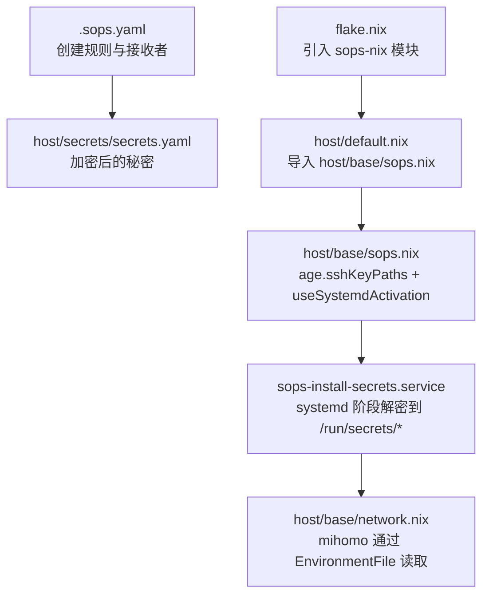
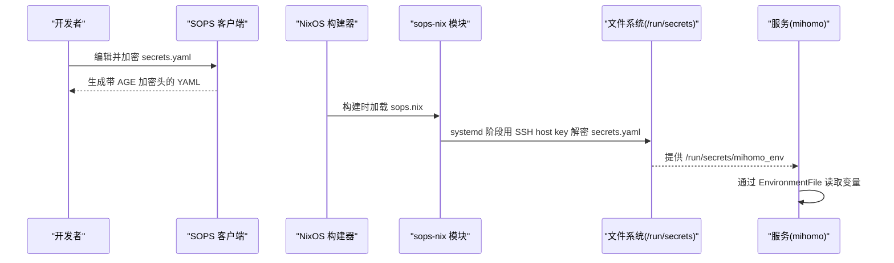
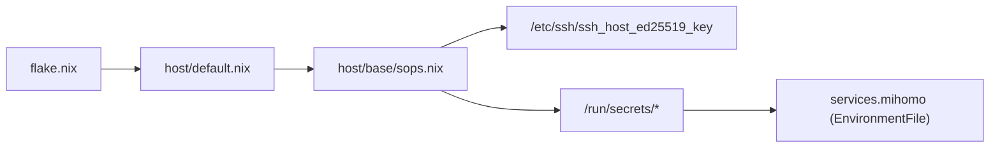

# SOPS 机密管理

本仓库使用 SOPS-Nix + Age 对敏感信息进行加密存储与分发：开发侧用 Age 公钥加密 `secrets.yaml`，NixOS 构建期由 sops-nix 用解密密钥（SSH host key）解密到 `/run/secrets/` 下的受控文件，服务（如 mihomo）以最小权限读取。实现「配置即代码 + 机密分离」。

> [!note] 2026-08-09 迁移
> 解密密钥已从独立 age key（`/persist/sops-age-key.txt`）切换到 **SSH host key**（`/etc/ssh/ssh_host_ed25519_key`），并启用 `useSystemdActivation`。原因与流程见 [memory 决策卡](../../memory/cards/sops-ssh-host-key.md) 与 [迁移指南](../../../Documents/MyVault/01_Inbox/sops%20迁移指南：SSH%20host%20key%20切换案例.md)。

## 目录
1. [涉及文件](#涉及文件)
2. [工作流程](#工作流程)
3. [配置详解](#配置详解)
4. [新增一项机密](#新增一项机密)
5. [密钥轮换](#密钥轮换)
6. [备份与恢复](#备份与恢复)
7. [故障排查](#故障排查)
8. [相关链接](#相关链接)

## 涉及文件
- `.sops.yaml`：SOPS 客户端配置，定义 Age 接收者（SSH host key 公钥）与创建规则。
- `host/secrets/secrets.yaml`：加密后的秘密清单（密文 + SOPS 元数据）。
- `host/base/sops.nix`：NixOS 模块，声明解密密钥来源（`age.sshKeyPaths`）、`useSystemdActivation`、默认密文文件与机密映射。
- `flake.nix`：引入 sops-nix 的 NixOS 模块。
- `host/default.nix`：导入 `host/base/sops.nix` 使配置生效。
- `host/base/network.nix`：mihomo 服务通过 `EnvironmentFile` 消费机密。

## 工作流程
下图展示从开发机编辑 `secrets.yaml`，到构建期解密，再到运行时服务读取的完整流程。

依赖关系：

## 配置详解
**客户端规则（`.sops.yaml`）**：`keys` 声明 Age 公钥（接收者）；`creation_rules` 用 `path_regex` 将 `host/secrets/secrets.yaml` 绑定到该公钥。只有持有对应 Age 私钥的人才能本地解密/重加密。当前唯一接收者为 SSH host key 的 age 公钥 `age14h8vny4...`。

**秘密清单（`host/secrets/secrets.yaml`）**：每个需加密的项作为顶层键（如 `mihomo_env`），值为 `ENC[...]` 密文；`sops` 段包含 age 收件人、`lastmodified`、`mac`、`unencrypted_suffix`、`version` 等元数据。

**NixOS 模块（`host/base/sops.nix`）**：
- `sops.age.sshKeyPaths = ["/etc/ssh/ssh_host_ed25519_key"]` 使用系统 SSH host key 作为解密私钥（免单独管理 age 私钥）。
- `sops.useSystemdActivation = true` 让 secrets 通过 `sops-install-secrets.service` 在 systemd 阶段安装（`after = local-fs.target`），而非 initrd activation script——避免 initrd 阶段读不到已挂载文件系统的时序问题。
- `sops.defaultSopsFile` 指定默认密文文件 `secrets/secrets.yaml`。
- `sops.secrets.<name>` 将键映射为 `/run/secrets/<name>` 并设置 owner/group/mode。当前 `mihomo_env` 为 `root:root`、`0400`。

**服务消费（`host/base/network.nix`）**：mihomo 服务声明 `after`/`wants` 依赖 **`sops-install-secrets.service`**（注意：不是 `sops-nix.service`，后者不存在），并通过 `EnvironmentFile = /run/secrets/mihomo_env` 注入环境变量。机密仅存在于进程生命周期内、`/run` 为临时目录重启即清理，避免落盘。

## 新增一项机密
1. 在 `secrets.yaml` 中添加新键（用 `sops` 命令编辑，值为占位符）。
2. 用 `sops` 按 `.sops.yaml` 规则重新加密该文件。
3. 在 `host/base/sops.nix` 的 `sops.secrets` 块声明新键，设置 owner/group/mode。
4. 在服务配置中通过 `/run/secrets/<name>` 引用（如 `EnvironmentFile`）。

## 密钥轮换
- 新增接收者：在 `.sops.yaml` 的 `keys` 添加新 Age 公钥，再用 `sops updatekeys`（需旧 key 权限）同步，使新旧接收者都可解密。
- 移除旧接收者：从 `.sops.yaml` 移除对应 `keys`，再用 `sops updatekeys` 同步，仅保留需要的接收者。
- 每次轮换会更新 MAC 与时间戳，确保完整性校验有效。
- 换 key 的完整流程与踩坑见 [memory 决策卡](../../memory/cards/sops-ssh-host-key.md)。

## 备份与恢复
- 备份：解密密钥 **SSH host key** `/etc/ssh/ssh_host_ed25519_key`（随系统迁移，无需单独备份）、密文 `secrets.yaml`、规则 `.sops.yaml`。
- 恢复：确认 SSH host key 就位，重建系统触发解密，验证 `/run/secrets/*` 已按预期生成。
- 迁移到新机器：新机器需**沿用同一 SSH host key**（或把自己的 host key 加入 `.sops.yaml` 接收者并 updatekeys），否则无法解密。

## 故障排查
- **构建报错找不到解密密钥**：确认 `/etc/ssh/ssh_host_ed25519_key` 存在且权限正确（root 可读）；确认 `.sops.yaml` 接收者与该 key 的 age 公钥匹配。
- **服务启动无环境变量**：确认服务依赖 `sops-install-secrets.service`（`after`/`wants`）；检查 `/run/secrets/<name>` 已生成且权限符合预期；确认 `useSystemdActivation = true`。
- **本地无法编辑 secrets.yaml**：本地安装 `sops`（已在 `home/dev/tools.nix`），解密需 root（key 文件 root 所有），用 `sudo nix shell nixpkgs#sops -c` 包装。
- **initrd 阶段报 setupSecrets 失败**：多为 `/persist` 等 stage-2 挂载点被 sops 依赖——改用 `useSystemdActivation = true` 让解密在 local-fs.target 之后进行。

## 相关链接
- 安全与隐私总览：[index.md](./index.md)
- Mihomo 网络代理（消费 `mihomo_env` 机密）：[../networking/mihomo.md](../networking/mihomo.md)
- 决策：mihomo TUN 栈与 `mihomo_env` 机密 → [mihomo-tun-stack](../../memory/cards/mihomo-tun-stack.md)
