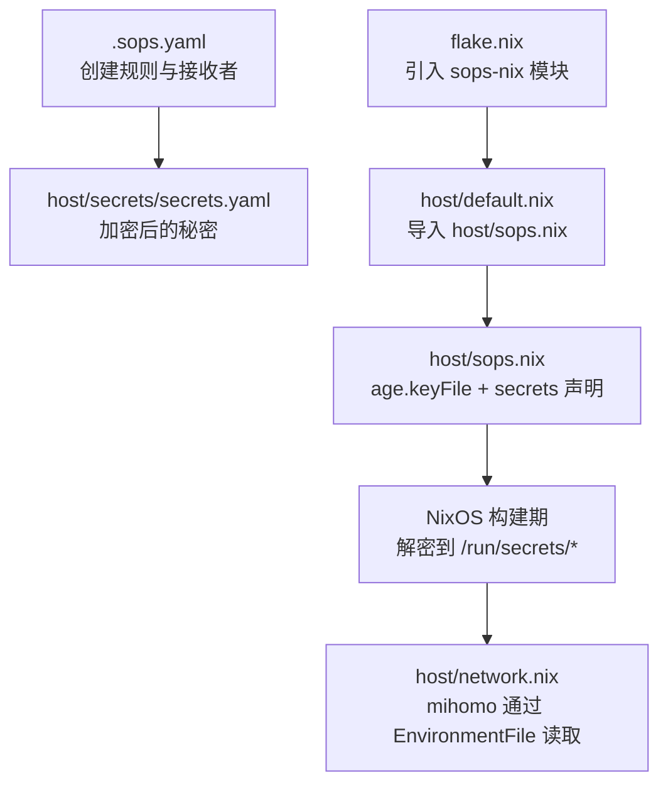
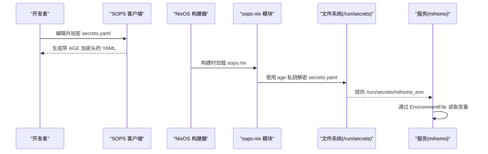
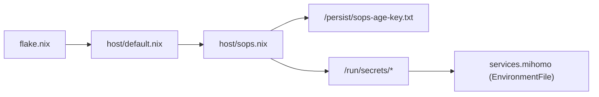

# SOPS 机密管理

本仓库使用 SOPS-Nix + Age 对敏感信息进行加密存储与分发：开发侧用 Age 公钥加密 `secrets.yaml`，NixOS 构建期由 sops-nix 用 Age 私钥解密到 `/run/secrets/` 下的受控文件，服务（如 mihomo）以最小权限读取。实现「配置即代码 + 机密分离」。

## 目录
1. [涉及文件](#涉及文件)
2. [工作流程](#工作流程)
3. [配置详解](#配置详解)
4. [新增一项机密](#新增一项机密)
5. [密钥轮换](#密钥轮换)
6. [备份与恢复](#备份与恢复)
7. [故障排查](#故障排查)
8. [相关链接](#相关链接)

## 涉及文件
- `.sops.yaml`：SOPS 客户端配置，定义 Age 接收者与创建规则。
- `host/secrets/secrets.yaml`：加密后的秘密清单（密文 + SOPS 元数据）。
- `host/sops.nix`：NixOS 模块，声明 age 私钥路径、默认密文文件与机密映射。
- `flake.nix`：引入 sops-nix 的 NixOS 模块。
- `host/default.nix`：导入 `host/sops.nix` 使配置生效。
- `host/network.nix`：mihomo 服务通过 `EnvironmentFile` 消费机密。

## 工作流程
下图展示从开发机编辑 `secrets.yaml`，到构建期解密，再到运行时服务读取的完整流程。

依赖关系：

## 配置详解
**客户端规则（`.sops.yaml`）**：`keys` 声明 Age 公钥（接收者）；`creation_rules` 用 `path_regex` 将 `host/secrets/secrets.yaml` 绑定到该公钥。只有持有对应 Age 私钥的人才能本地解密/重加密。

**秘密清单（`host/secrets/secrets.yaml`）**：每个需加密的项作为顶层键（如 `mihomo_env`），值为 `ENC[...]` 密文；`sops` 段包含 age 收件人、`lastmodified`、`mac`、`unencrypted_suffix`、`version` 等元数据。

**NixOS 模块（`host/sops.nix`）**：
- `sops.age.keyFile` 指向持久化私钥 `/persist/sops-age-key.txt`。
- `sops.defaultSopsFile` 指定默认密文文件 `secrets/secrets.yaml`。
- `sops.secrets.<name>` 将键映射为 `/run/secrets/<name>` 并设置 owner/group/mode。当前 `mihomo_env` 为 `root:root`、`0400`。

**服务消费（`host/network.nix`）**：mihomo 服务声明 `after`/`wants` 依赖 `sops-nix.service`，并通过 `EnvironmentFile = /run/secrets/mihomo_env` 注入环境变量。机密仅存在于进程生命周期内、`/run` 为临时目录重启即清理，避免落盘。

## 新增一项机密
1. 在 `secrets.yaml` 中添加新键（用 `sops` 命令编辑，值为占位符）。
2. 用 `sops` 按 `.sops.yaml` 规则重新加密该文件。
3. 在 `host/sops.nix` 的 `sops.secrets` 块声明新键，设置 owner/group/mode。
4. 在服务配置中通过 `/run/secrets/<name>` 引用（如 `EnvironmentFile`）。

## 密钥轮换
- 新增接收者：在 `.sops.yaml` 的 `keys` 添加新 Age 公钥，再用 `sops` 重新加密使新旧接收者都可解密。
- 移除旧接收者：再次用 `sops` 重新加密，仅保留需要的接收者。
- 每次轮换会更新 MAC 与时间戳，确保完整性校验有效。

## 备份与恢复
- 备份：私钥 `/persist/sops-age-key.txt`、密文 `secrets.yaml`、规则 `.sops.yaml`。
- 恢复：将私钥放回 `/persist/sops-age-key.txt` 并设为仅 root 可读（0400），重建系统触发解密，验证 `/run/secrets/*` 已按预期生成。

## 故障排查
- **构建报错找不到 age 私钥**：确认 `/persist/sops-age-key.txt` 存在且权限正确（仅 root 可读）；确认 sops-nix 模块已正确引入。
- **服务启动无环境变量**：确认服务依赖 `sops-nix.service`（`after`/`wants`）；检查 `/run/secrets/<name>` 已生成且权限符合预期。
- **本地无法编辑 secrets.yaml**：本地安装 `sops` 与 `age`，并确保私钥与 `.sops.yaml` 中的接收者匹配。

## 相关链接
- 安全与隐私总览：[index.md](./index.md)
- Mihomo 网络代理（消费 `mihomo_env` 机密）：[../networking/mihomo.md](../networking/mihomo.md)
- 决策：mihomo TUN 栈与 `mihomo_env` 机密 → [mihomo-tun-stack](../../memory/cards/mihomo-tun-stack.md)
