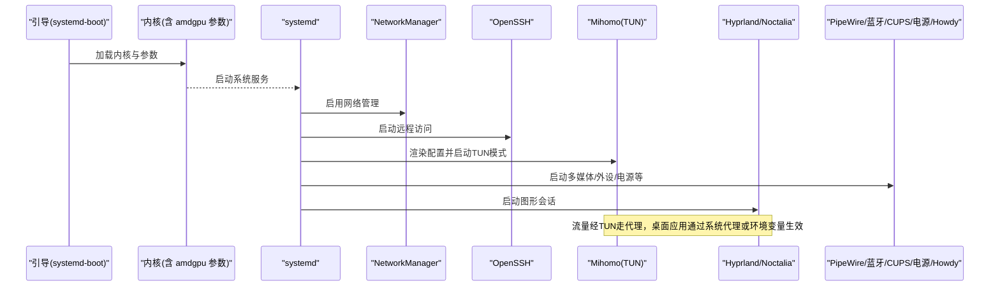

# 系统服务

主机侧 systemd 服务总览：网络与代理、音频、蓝牙、打印、电源管理、生物识别与权限。系统级配置集中在 `host/services.nix` 与 `host/network.nix`，由 `host/default.nix` 汇总导入。

## 目录

1. [服务编排总览](#服务编排总览)
2. [网络与代理](#网络与代理)
3. [音频 / 蓝牙 / 打印](#音频--蓝牙--打印)
4. [电源与存储维护](#电源与存储维护)
5. [生物识别 Howdy](#生物识别-howdy)
6. [权限与安全](#权限与安全)
7. [常用命令](#常用命令)
8. [故障排查](#故障排查)
9. [相关链接](#相关链接)

## 服务编排总览



## 网络与代理

`host/network.nix` 定义主机名、NetworkManager 与 OpenSSH（开启密码认证便于远程登录）。核心是 Mihomo TUN 代理：

- `services.mihomo` 以 `tunMode` 运行，WebUI 使用 `zashboard`。
- `systemd.services.mihomo` 通过 `after`/`wants` 依赖 `sops-install-secrets.service`，确保加密的环境变量（订阅链接等）就绪后再启动。
- `preStart` 用 `envsubst` 将 `mihomo-config.yaml.in` 渲染到 `/run/mihomo/config.yaml`，敏感信息不入库。
- 开启 IPv4/IPv6 转发，启用 `nftables` 防火墙，仅放行必要端口（TCP/UDP 53317，信任 `Meta` 接口）。
- 附带网络诊断工具：`dnsutils`、`iputils`、`tcpdump`、`mtr`、`nmap`、`iperf3`、`ethtool`、`iptables`。

详细代理配置见 [Mihomo 代理](networking/mihomo.md)。

## 音频 / 蓝牙 / 打印

`host/services.nix`：

- `services.pipewire` 启用，并开 PulseAudio 兼容、ALSA（含 32 位）与 JACK，作为统一音频后端。
- `hardware.bluetooth` 启用且 `powerOnBoot`，开机自动上电。
- `services.printing`（CUPS）提供系统级打印。
- `services.gvfs` 启用虚拟文件系统，配合 `ntfs3g` 挂载 NTFS。

## 电源与存储维护

- `power-profiles-daemon` + `upower`：电源策略与电池状态管理。
- `fstrim` 定期 TRIM，保持 SSD 性能与寿命。
- `fs.inotify.max_user_watches = 524288`：提升文件监听上限，满足大型项目开发监控需求。

## 生物识别 Howdy

`services.howdy` 启用 IR 红外人脸解锁，摄像头设备 `/dev/video2`，格式 `v4l2`，`dark_threshold = 100`。通过 `security.pam.services` 以 `sufficient` 控制集成到 sudo / su / login / greetd / noctalia。PAM 细节见 [PAM 认证](security/pam.md)。

## 权限与安全

- `security.polkit` 启用并添加规则，允许 `wheel` 组用户应用 Noctalia 外观（`org.noctalia.greeter.apply-appearance`）。
- `security.rtkit` 启用，提升实时音频任务优先级。
- 普通用户的 sudo 白名单在 `host/users.nix`，仅放行必要的 rebuild 与文本处理命令，遵循最小权限。

## 常用命令

```bash
systemctl status <服务名>          # 查看状态
systemctl restart <服务名>         # 重启服务
journalctl -u mihomo --since "今天"  # 查看服务日志
nmcli device status               # 网络连接状态
```

## 故障排查

- **网络不通/代理异常**：检查 NetworkManager 连接与 nftables 放行；确认 mihomo 已启动、TUN 接口绑定成功；验证 sops-nix 是否成功注入环境变量。
- **无法远程登录**：确认 OpenSSH 启用且防火墙放行。
- **打印失败**：确认 CUPS 运行，检查驱动与队列。
- **蓝牙不可用**：确认蓝牙启用且 `powerOnBoot`，检查设备节点与权限。
- **电源管理异常**：检查 `power-profiles-daemon` 与 `upower` 状态与日志。
- **Howdy 无法识别**：确认视频设备路径、PAM 集成与摄像头可用性。

## 相关链接

- [Mihomo 代理](networking/mihomo.md) — TUN 代理与 nftables 详解
- [PAM 认证](security/pam.md) — Howdy 与 PAM 集成
- [部署与维护](deployment.md) — 服务生命周期与 rebuild
- [故障排除总览](troubleshooting.md)
- memory：[mihomo-tun-stack](../memory/cards/mihomo-tun-stack.md)
