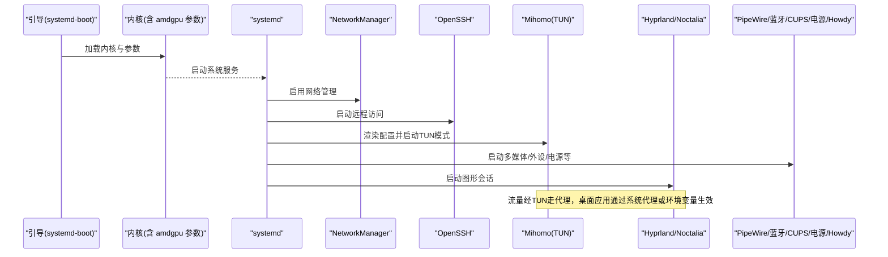

# 系统服务

主机侧 systemd 服务总览：网络与代理、音频、蓝牙、打印、电源管理、生物识别与权限。系统级配置集中在 `host/base/services.nix` 与 `host/base/network.nix`，由 `host/default.nix` 汇总导入。

## 目录

1. [服务编排总览](#服务编排总览)
2. [网络与代理](#网络与代理)
3. [音频 / 蓝牙 / 打印](#音频--蓝牙--打印)
4. [电源与存储维护](#电源与存储维护)
5. [生物识别 Howdy](#生物识别-howdy)
6. [权限与安全](#权限与安全)
7. [常用命令](#常用命令)
8. [故障排查](#故障排查)
9. [相关链接](#相关链接)

## 服务编排总览


```mermaid
sequenceDiagram
participant Boot as "引导(systemd-boot)"
participant Kernel as "内核(含 amdgpu 参数)"
participant Systemd as "systemd"
participant Net as "NetworkManager"
participant SSH as "OpenSSH"
participant Proxy as "Mihomo(TUN)"
participant Desktop as "Hyprland/Noctalia"
participant Services as "PipeWire/蓝牙/CUPS/电源/Howdy"
Boot->>Kernel : 加载内核与参数
Kernel-->>Systemd : 启动系统服务
Systemd->>Net : 启用网络管理
Systemd->>SSH : 启动远程访问
Systemd->>Proxy : 渲染配置并启动TUN模式
Systemd->>Services : 启动多媒体/外设/电源等
Systemd->>Desktop : 启动图形会话
Note over Proxy,Desktop : 流量经TUN走代理，桌面应用通过系统代理或环境变量生效
```

## 网络与代理

`host/base/network.nix` 定义主机名、NetworkManager、Avahi mDNS 与 OpenSSH（开启密码认证便于远程登录）。核心是 Mihomo TUN 代理：

- `services.avahi` 广播 `MechRevo-NixOS.local` 及本机地址，局域网内的 SSH 客户端可以使用主机名而不是 DHCP 地址。
- `services.avahi.nssmdns4` 让本机程序解析 IPv4 `.local` 名称；防火墙由模块自动放行 mDNS UDP 5353。
- `services.mihomo` 以 `tunMode` 运行，WebUI 使用 `zashboard`。
- `systemd.services.mihomo` 通过 `after`/`wants` 依赖 `sops-install-secrets.service`，确保加密的环境变量（订阅链接等）就绪后再启动。
- `preStart` 用 `envsubst` 将 `mihomo-config.yaml.in` 渲染到 `/run/mihomo/config.yaml`，敏感信息不入库。
- 开启 IPv4/IPv6 转发，启用 `nftables` 防火墙，仅放行必要端口（TCP/UDP 53317，信任 `Meta` 接口）。
- 附带网络诊断工具：`dnsutils`、`iputils`、`tcpdump`、`mtr`、`nmap`、`iperf3`、`ethtool`、`iptables`。

详细代理配置见 [Mihomo 代理](networking/mihomo.md)。

## 音频 / 蓝牙 / 打印

`host/base/services.nix`：

- `services.pipewire` 启用，并开 PulseAudio 兼容、ALSA（含 32 位）与 JACK，作为统一音频后端。
- `hardware.bluetooth` 启用且 `powerOnBoot`，开机自动上电。
- `services.printing`（CUPS）提供系统级打印。
- `services.gvfs` 启用虚拟文件系统，配合 `ntfs3g` 挂载 NTFS。
- `environment.systemPackages` 含 `ntfs3g` 与 `bubblewrap`：后者供 Strata 的预览沙箱使用（它按固定系统目录解析 `bwrap`，不读 `PATH`，见 [文件管理器与归档工具](productivity/files.md)）。
- `services.flatpak.enable` 提供用户级 Flatpak 的系统运行时；具体应用仍按主要用途放在对应的 Home Manager 模块。

## 电源与存储维护

电源管理由系统层 `host/base/tlp.nix`（**TLP 1.10.2**）与会话层 `home/env/power-actions.nix` 组成。
原来的 `power-profiles-daemon`（ppd）与自写策略 `host/base/power.nix`（`powerPolicy.*`）已整块删除：
自写策略要自己维护阈值、udev 触发、timer、hold 保护和 DPM 同步，而这些 TLP 已经原生覆盖，
只剩「TLP 不按电量自适应」这一件事需要我们补。

`services.tlp.pd.enable = true` 让 TLP 提供 ppd 兼容的 D-Bus（`net.hadess.PowerProfiles` 与
`org.freedesktop.UPower.PowerProfiles` 两个名字都装），桌面面板照旧能读能切；同时
`services.power-profiles-daemon.enable = false`（NixOS 模块对二者有冲突断言，不能同时开）。
Nix 侧只暴露三个选项：`powerTlp.enable`（默认 `true`）、`powerTlp.maxFreq`（默认 `5137904` kHz =
本机 `cpuinfo_max_freq` / `amd_pstate_max_freq`）与 `powerTlp.powerSaverMaxFreq`（默认 `2400000` kHz）。

**档位由 TLP 参数后缀决定**：`_ON_AC` = performance 档、`_ON_BAT` = balanced 档、`_ON_SAV` = power-saver 档。
**没有 `_SAV` 后缀的特性在省电档回落到 `_BAT` 值**；TLP 没有内建默认值的参数必须三档都写，否则档位行为不确定。
TLP 是唯一事实源：手动、面板、`power-actions` 读写的都是同一份 profile。

**两态项跟的是「档位」而不是「电源」**：`_ON_AC` 参数在 performance 档生效、`_ON_BAT` 在 balanced 档生效、
power-saver 档若没有 `_SAV` 就回落到 `_ON_BAT`。也就是说**插着电但处于均衡档时，走的仍是"电池那套"省电值**，
只有手动切到 performance 档才放开。实测同一台机器切档看 PCIe / NVMe runtime PM：balanced 与 power-saver 档下
39 个 PCIe 设备 `power/control=auto`、NVMe 为 **auto**（空闲断电）；performance 档变成 36 个 `on`、
NVMe 为 **on**（保持通电）。

| 档位 | governor | EPP | boost | `scaling_max_freq` | 核显 DPM | ABM |
| --- | --- | --- | --- | --- | --- | --- |
| performance（**仅手动**） | `performance` | `performance` | `1` | `5137904` | `auto` | `0` |
| balanced（默认） | `powersave` | `balance_performance` | `1` | `5137904` | `auto` | `0` |
| power-saver | `powersave` | `power` | `0` | **`2400000`** | `low` | `1` |

上表为真机 `tlpctl set` 后读 sysfs 的实测值，三档往返切换两次结果一致；三档 `scaling_min_freq` 都是 `1100980`。

**关键坑（真机踩过）：`CPU_SCALING_MAX_FREQ_*` 只写「非空且非 0」的值。**
TLP 源码 `func.d/10-tlp-func-cpu` 的判断是 `[ -n "$maxfreq" ] && [ "$maxfreq" != "0" ]`，
所以如果均衡/性能档写成 `0`（想表达"不修改"），省电档把 `scaling_max_freq` 压到 2.4GHz 后，
**切回均衡/性能档时没人把它写回去**，2.4GHz 会一直粘住。
修法就是均衡/性能档显式写 `powerTlp.maxFreq`（`5137904`），只有省电档写 `powerSaverMaxFreq`（`2400000`）；
六项 `CPU_SCALING_MIN_FREQ_*` 全是 `0`（不修改），保留内核默认的最低非线性频率 `1100980`。

行为开关（写死在 `host/base/tlp.nix`，故意不让 TLP 自己动）：

- `TLP_DISABLE_DEFAULTS=0`：保留 TLP 自家的省电默认。
- `TLP_AUTO_SWITCH=0`：不让 TLP 按插拔自动切档——自动决策统一交给会话层，避免两个改档者互相覆盖。
- `TLP_PROFILE_DEFAULT=BAL`、`TLP_PROFILE_AC=BAL`、`TLP_PROFILE_BAT=BAL`：双保险，**永不自动进 performance**。
- `WIFI_PWR_ON_AC/BAT = "off"`：TLP 默认会在电池上开 wifi 省电，Intel AX200 上这是常见的卡顿来源，故钉死关闭（「wifi 别管」）。
  `tlp-stat -c` 可见这两行；`/sys/class/net/<if>/device/power/control = auto` 是 PCIe runtime PM，与 wifi 省电是两回事。
- ABM 三项（`AMDGPU_ABM_LEVEL_ON_AC/BAT/SAV` = `0/0/1`）在本机是**空操作**：核显没有暴露
  `/sys/class/drm/*/device/amdgpu/panel_power_savings` 节点，TLP 静默跳过；保留是为了换机型/内核后能生效。

`TLP_DISABLE_DEFAULTS=0` 会保留 TLP 自带的省电项：PCIe ASPM、PCIe 设备空闲断电、硬盘空闲挂起、
声卡省电、USB autosuspend。本机是纯 NVMe，机械盘相关项（APM/降速）不适用。

自动策略只有一条，由用户侧 `power-profile-actions.timer`（每 30s 跑一次 `power-actions run`）执行：

- 用电池且电量 **< 40%** → 省电档
- 插电且电量 **≥ 60%** → 均衡档
- 其余 → 不动（40% 与 60% 之间是 20% 的滞回带）

语义要点：

- **只自动在 balanced ↔ power-saver 之间切，永不自动进 performance**；性能档只由人手动开。
- **边沿触发**：只在「跨过阈值」那一刻动手，用户在同一区间里手动选的档位不会被下一轮顶掉；不处理 TLP profile hold。
- 实机日志样例：`电量策略: 插电 100% >= 60%，档位 -> balanced`。
- **会话锁屏时策略切档会失败**（polkit 要求 active 会话）：脚本不推进 band 游标，解锁后下一轮（30s 内）自动重试，无需手动补救。

手动与游戏入口：

| 做什么 | 怎么做 |
| --- | --- |
| 切档（桌面面板） | tlp-pd 提供的 ppd 兼容 D-Bus，Noctalia / GNOME 电源菜单直接可用 |
| 切档（CLI） | `tlpctl set performance` / `balanced` / `power-saver`（普通用户即可，polkit `allow_active`） |
| 统一封装 | `power-actions mode <档位>`（同一件事的封装，并**立刻**同步会话层） |
| 状态一览 | `power-actions status`、`tlpctl get`、`tlpctl list` |
| 游戏提性能 | 用户自己手动切 performance；本配置不用 gamemode |
| 改均衡/性能档 CPU 上限 | `host/base/tlp.nix` 的 `powerTlp.maxFreq`（必须等于本机 `cpuinfo_max_freq`，见上文坑） |
| 改省电档 CPU 上限 | `host/base/tlp.nix` 的 `powerTlp.powerSaverMaxFreq` |
| 改会话层行为 | `home/env/power-actions.nix` 的 `powerActions.*`（`darkMode` / `hyprlandEffects.keywords` / `pauseUserUnits` / `pollSeconds`） |

- `power-profile-actions.timer`（30s）跑 `power-actions run`：先电量策略、再会话对齐。
- `tlp-stat -s` 显示 `TLP profile = balanced/BAT`——这里的 `BAL` 是旧 `BAT` 模式的映射，**不是**"正在用电池"；
  同处还会显示 `tlp-pd = enabled, running`。

### 排障与回滚

| 目的 | 命令 |
| --- | --- |
| 有效配置 | `tlp-stat -c`（可核对 `WIFI_PWR_ON_*` 等生效值） |
| 模式与电源 | `tlp-stat -s` |
| CPU 状态 | `tlp-stat -p` |
| 核显状态 | `tlp-stat -g` |
| 档位 | `tlpctl get` / `tlpctl list` |
| 频率上限是否真的切了 | `cat /sys/devices/system/cpu/cpufreq/policy0/scaling_max_freq` |
| 会话层状态 | `power-actions status` |
| 定时器日志 | `journalctl --user -u power-profile-actions -n 20` |

- **离开省电档后 CPU 仍被卡在 2.4GHz**：就是 `CPU_SCALING_MAX_FREQ_*` 写成了 `0` 的旧坑，按上文改成 `powerTlp.maxFreq`。
- **新建的 `.nix` 文件没进 git 时 rebuild 看不到**：`nixos-rebuild --flake /home/lishangshui/myNixOSConfig`
  只读 Git 已跟踪的文件，会报 `Path 'host/base/tlp.nix' ... is not tracked by Git`。绕法是用
  `--flake "path:/home/lishangshui/myNixOSConfig"`，或把新文件 `git add`（正式做法是走提交流程）。
- 回滚：启动菜单选上一个 system generation，或 `sudo nixos-rebuild switch --rollback`。
- 软关：把 `host/base/tlp.nix` 的 `powerTlp.enable = false`（等价的 `TLP_ENABLE=0`）再 rebuild。

### 会话层动作（`power-actions`）

档位变化时由用户侧 `power-profile-actions.timer`（每 30s，挂 `graphical-session.target`）执行 `home/env/power-actions.nix`：

| 进入 `power-saver` | 离开 `power-saver` |
| --- | --- |
| `darkman set dark`（已经是 dark 就不动） | **什么都不做**——交给 darkman 自己的日出/日落调度；手动切回用 `Super+Shift+D` |
| 关闭阴影与动画（`decoration:shadow:enabled`、`animations:enabled`）、把窗口透明 `decoration:active_opacity` / `inactive_opacity` → `1.0`；模糊**不关**，改成便宜参数（`decoration:blur:size` → `5`、`decoration:blur:passes` → `2`） | 按进入时保存的**原值**恢复（本机透明 `0.88` / `0.82`、模糊 `15` / `4`，来自 `home/de/hyprland.nix`） |
| 暂停 `pauseUserUnits`（默认 `onedrive`）里本来就 active 的单元 | 启动之前停掉的单元 |

- 只在**档位变化**时动手（state 文件记上次档位）：`darkman set` 会触发 theme-apply（Matugen 重渲染 + 重启 fcitx5），不能每 30s 跑。
- 关/开特效与透明走 `hyprctl eval 'hl.config({…})'`：0.56 的 Lua 解析器下旧的 `hyprctl keyword` **不生效但退出码仍是 0**，所以脚本按输出是否为 `ok` 判定成败；读值仍用 `hyprctl -j getoption`（bool 型是 `"bool": true`，int 型是 `"int": N`，float 型是 `"float": 0.88`，要按类型解析）。
- **省电档为什么不关模糊、而是调便宜**：`foot`（`alpha=0.8`）、Noctalia 的 bar/panel、fcitx5 候选窗都是**应用自己画的半透明**，把 `decoration:blur:enabled` 关掉后它们就直接透出桌面（观感像"变透明"），比留着模糊更难看。成本模型（源码 `blurFramebufferWithDamage`）：强度 ≈ `size × 2^passes`，开销 ≈ `2 × passes` 次全分辨率 draw（**与 `size` 几乎无关**），硬上限 `size ≤ 40`、`passes ≤ 8`（超了会被 clamp）。本机原值 `15 / 4`（半径 240、8 次 draw）→ 省电档 `5 / 2`（半径 20、4 次 draw，模糊开销减半）。想更"挡"先加 `size`（几乎免费），不够再加 `passes`。
- 排障顺序：`power-actions status` → `journalctl --user -u power-profile-actions -n 20` → `power-actions revert`。
- niri 会话没有 `hyprctl` 运行时接口，特效那部分自然空操作；GNOME 变体下 darkman/Hyprland 都不在跑，只剩 onedrive 暂停。

本机做不到的：EC 性能档与风扇曲线（没有 ACPI `platform_profile`）、电池充电阈值——BAT0 既没有
`charge_control_start_threshold` / `charge_control_end_threshold`，也没有 `charge_behaviour`；
TLP 日志里那句 `Setting battery charge thresholds...done.` 是通用输出，实际什么都没设。

其余：

- `upower`：电池/电源状态管理。
- `fstrim` 定期 TRIM，保持 SSD 性能与寿命。
- `fs.inotify.max_user_watches = 524288`：提升文件监听上限，满足大型项目开发监控需求。

## 生物识别 Howdy

`services.howdy` 启用 IR 红外人脸解锁，摄像头设备 `/dev/video2`，格式 `v4l2`，`dark_threshold = 100`。通过 `security.pam.services` 以 `sufficient` 控制集成到 sudo / su / login / greetd / noctalia。PAM 细节见 [PAM 认证](security/pam.md)。

## 权限与安全

- `security.polkit` 启用并添加规则，允许 `wheel` 组用户应用 Noctalia 外观（`org.noctalia.greeter.apply-appearance`）。
- `security.rtkit` 启用，提升实时音频任务优先级。
- 普通用户的 sudo 白名单在 `host/base/users.nix`，仅放行必要的 rebuild 与文本处理命令，遵循最小权限。

## 常用命令

```bash
systemctl status <服务名>          # 查看状态
systemctl restart <服务名>         # 重启服务
journalctl -u mihomo --since "今天"  # 查看服务日志
nmcli device status               # 网络连接状态
```

## 故障排查

- **网络不通/代理异常**：检查 NetworkManager 连接与 nftables 放行；确认 mihomo 已启动、TUN 接口绑定成功；验证 sops-nix 是否成功注入环境变量。
- **无法远程登录**：确认 OpenSSH 启用且防火墙放行。
- **主机名无法解析**：确认 `avahi-daemon` 处于 active，使用 `avahi-resolve -4 -n MechRevo-NixOS.local` 或 `getent ahostsv4 MechRevo-NixOS.local` 检查；客户端与本机必须在允许 mDNS 的同一局域网内。
- **打印失败**：确认 CUPS 运行，检查驱动与队列。
- **蓝牙不可用**：确认蓝牙启用且 `powerOnBoot`，检查设备节点与权限。
- **电源管理异常**：`tlp-stat -s` 看模式与电源、`tlp-stat -c` 看有效配置，`systemctl status tlp` 看服务；`upower` 只管电池状态。
- **Howdy 无法识别**：确认视频设备路径、PAM 集成与摄像头可用性。

## 相关链接

- [Mihomo 代理](networking/mihomo.md) — TUN 代理与 nftables 详解
- [PAM 认证](security/pam.md) — Howdy 与 PAM 集成
- [部署与维护](deployment.md) — 服务生命周期与 rebuild
- [故障排除总览](troubleshooting.md)
- memory：[mihomo-tun-stack](../memory/cards/mihomo-tun-stack.md)
